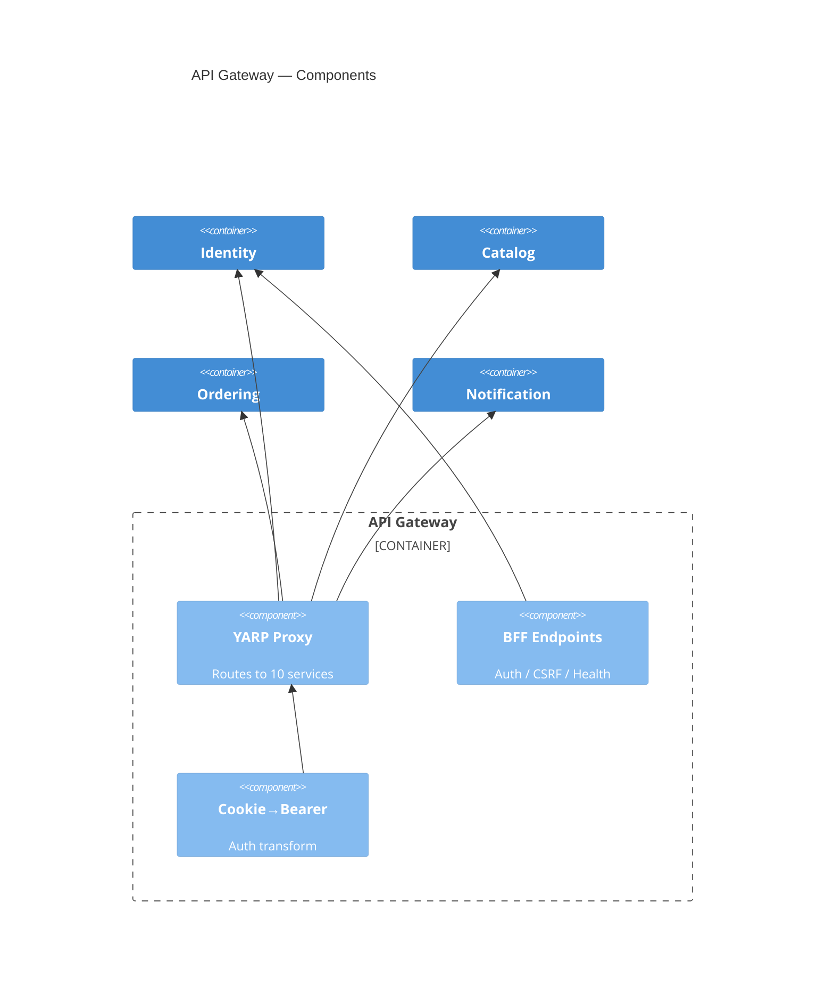
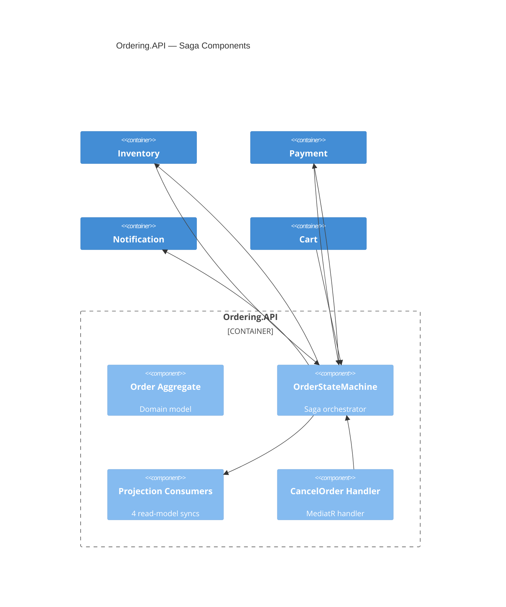
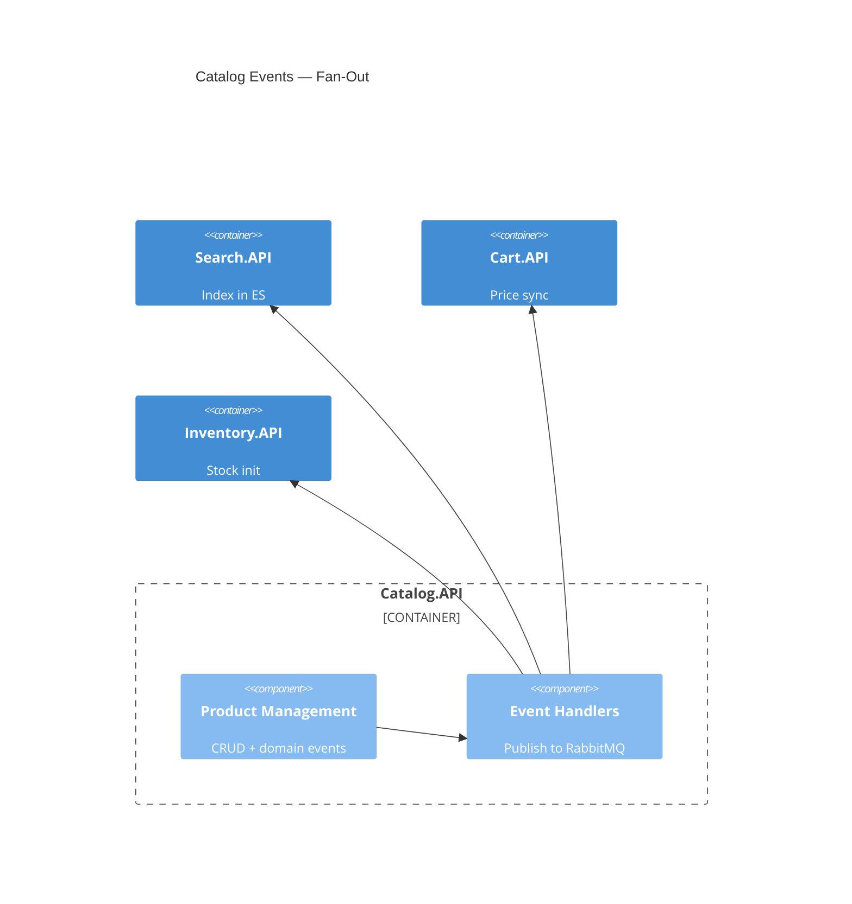
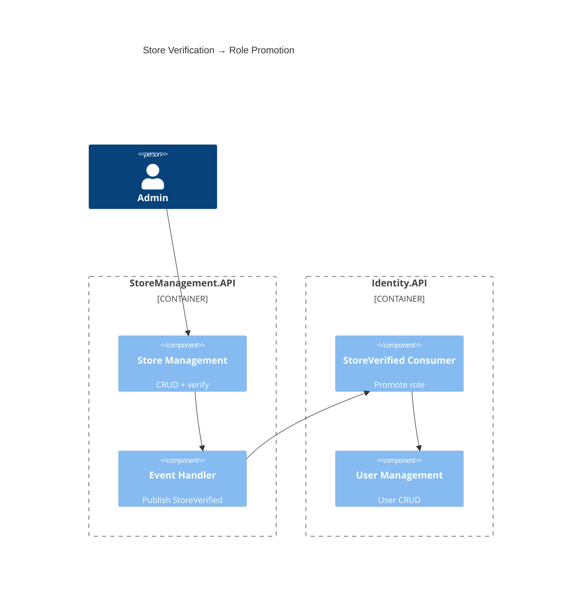

# C4 Component Index — Marketplace Microservices Platform

## System Components

| # | Service | Component | Description |
|---|---------|-----------|-------------|
| 1 | Identity.API | Auth Endpoints | Registration, login, password management |
| 2 | Identity.API | User Management | CRUD users, role management, profile |
| 3 | Identity.API | Saved Searches | User saved search queries |
| 4 | Identity.API | StoreVerified Consumer | Promotes user to Seller on store verification |
| 5 | Catalog.API | Product Management | Product CRUD with domain events |
| 6 | Catalog.API | Category Management | Category tree CRUD |
| 7 | Catalog.API | Review System | Product reviews, votes, seller responses |
| 8 | Catalog.API | Recommendations | "Frequently bought together" suggestions |
| 9 | Search.API | Elasticsearch Service | Full-text search with faceted filters |
| 10 | Search.API | Product Event Consumers | Indexes/removes products on Catalog events |
| 11 | Cart.API | Cart Management | Cart CRUD, single-item operations |
| 12 | Cart.API | Checkout Orchestration | Publishes OrderSubmittedEvent on checkout |
| 13 | Cart.API | Product Price Sync | Syncs product prices from Catalog events |
| 14 | Ordering.API | Order Aggregate | Domain model for order lifecycle |
| 15 | Ordering.API | OrderStateMachine (Saga) | Orchestrates checkout flow |
| 16 | Ordering.API | Projection Consumers | Syncs saga state to Order read model |
| 17 | Ordering.API | Cancel Order Handler | Publishes CancelOrderEvent to saga |
| 18 | Inventory.API | Inventory Management | Stock tracking, CRUD, batch lookup |
| 19 | Inventory.API | Reservation Consumer | Reserves/releases stock on saga commands |
| 20 | Inventory.API | Product Created Consumer | Initializes inventory for new products |
| 21 | Payment.API | Payment Processing | Simulated gateway, transaction persistence |
| 22 | Payment.API | ProcessPayment Consumer | Handles ProcessPaymentCommand |
| 23 | Notification.Worker | SignalR Hub | Real-time push to connected clients |
| 24 | Notification.Worker | Order Event Consumers | Pushes order status via SignalR |
| 25 | StoreManagement.API | Store Management | Store CRUD, verification, logo upload |
| 26 | Media.API | Media Management | Image upload, thumbnails, blob storage |
| 27 | API Gateway | YARP Reverse Proxy | Route proxying to downstream services |
| 28 | API Gateway | BFF Endpoints | Auth proxy, CSRF, user session, health |
| 29 | API Gateway | Cookie-to-Bearer Middleware | Transforms cookie session to JWT Bearer |
| 30 | BuildingBlocks | SharedContracts | Events, commands, DTOs, abstractions |
| 31 | BuildingBlocks | Infrastructure | Middleware, behaviors, repo base |

---

## Component Diagrams (per service)

### Diagram 1: API Gateway Components

**Gateway component responsibilities:**

| Component | Role |
|-----------|------|
| YARP Proxy | Routes `/api/**` and `/hubs/**` to downstream services |
| BFF Endpoints | Login, register, logout, CSRF token, user session, health probes |
| Cookie→Bearer | Transforms cookie session to JWT Bearer for downstream calls |

---

### Diagram 2: Ordering Service (Saga Orchestrator)

**Ordering component interactions:**

| From | To | Message | Transport |
|------|----|---------|-----------|
| Cart | OrderStateMachine | OrderSubmittedEvent | RabbitMQ |
| OrderStateMachine | Inventory | ReserveInventoryCommand | RabbitMQ |
| Inventory | OrderStateMachine | InventoryReserved/Failed | RabbitMQ |
| OrderStateMachine | Payment | ProcessPaymentCommand | RabbitMQ |
| Payment | OrderStateMachine | PaymentCompleted/Failed | RabbitMQ |
| OrderStateMachine | Notification | OrderCompleted/Cancelled | RabbitMQ |
| OrderStateMachine | Projection Consumers | State changes | In-process |
| CancelOrder Handler | OrderStateMachine | CancelOrderEvent | RabbitMQ |

---

### Diagram 3: Catalog → Downstream Consumers

**Fan-out event routing:**

| Event | Search | Cart | Inventory |
|-------|--------|------|-----------|
| ProductCreated | Index | Price sync | Init stock |
| ProductUpdated | Reindex | Price sync | — |
| ProductPriceChanged | — | Price update | — |
| ProductDeleted | Remove | Remove price | — |

---

### Diagram 4: Store → Identity (Role Promotion)

**Role promotion flow:**

| Step | Action |
|------|--------|
| 1 | Admin calls `POST /api/stores/{id}/verify` |
| 2 | StoreVerified domain event fires |
| 3 | Handler publishes `StoreVerifiedIntegrationEvent` |
| 4 | Identity consumer promotes user role: Buyer → Seller |

---

## Related Documentation

- [Context Documentation](c4-context.md) — System context with personas
- [Container Documentation](c4-container.md) — Deployment containers and APIs
- [Interaction Diagram](c4-interaction-diagram.md) — Service-to-service communication
