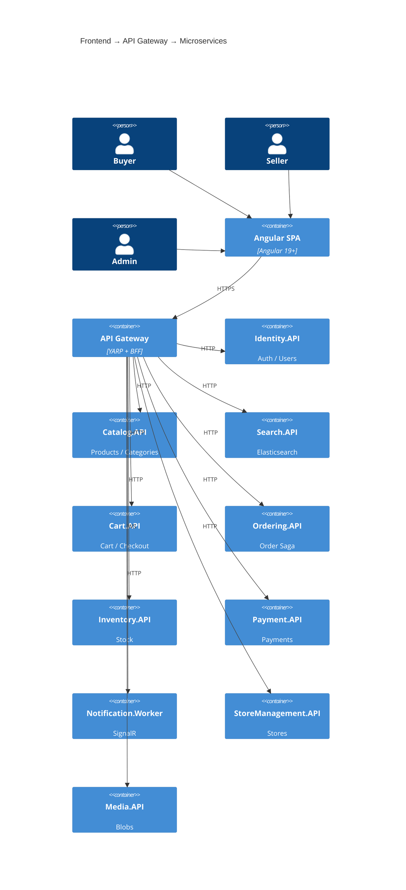
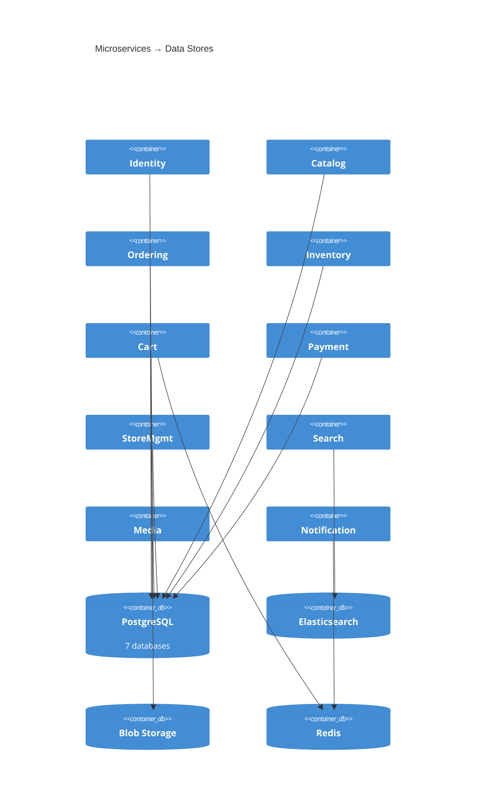
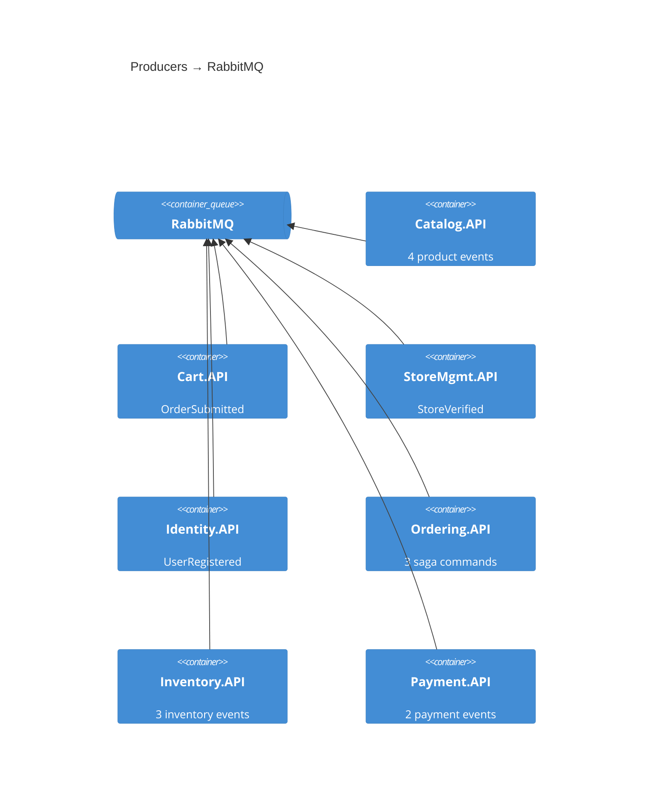
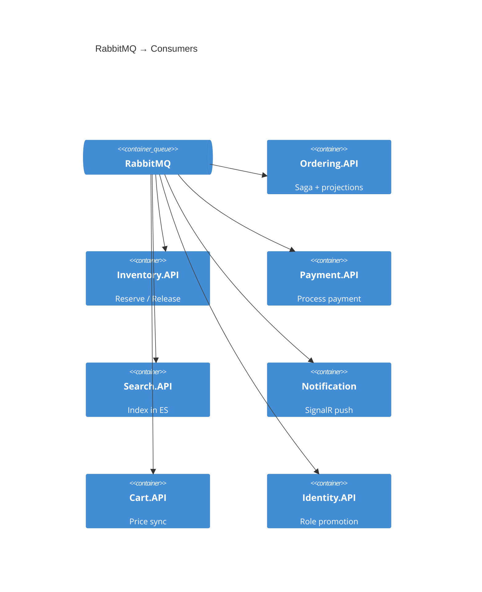
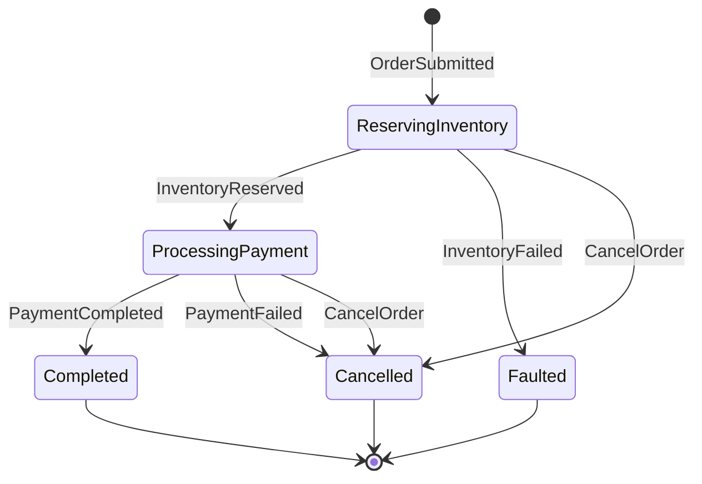

# C4 Container — Marketplace Microservices Platform

## Overview

The Marketplace platform consists of 10 microservices, an API Gateway, an Angular SPA, and 5 backing infrastructure resources. Each microservice owns its database (database-per-service pattern) and communicates asynchronously via MassTransit over RabbitMQ. The Ordering service acts as a saga orchestrator for the checkout flow.

---

## Container Diagrams

### Diagram 1: Frontend → Gateway → Services

**Route mapping** (see [API Gateway Routes](#api-gateway-routes) table below for full details):

| Gateway Route | Target |
|---------------|--------|
| `/api/identity/**` | Identity.API |
| `/api/catalog/**` | Catalog.API |
| `/api/search/**` | Search.API |
| `/api/cart/**` | Cart.API |
| `/api/orders/**` | Ordering.API |
| `/api/inventory/**` | Inventory.API |
| `/api/payments/**` | Payment.API |
| `/hubs/**` | Notification.Worker |
| `/api/stores/**` | StoreManagement.API |
| `/api/media/**` | Media.API |

---

### Diagram 2: Services → Data Stores

**Database mapping:**

| Service | Database | Notes |
|---------|----------|-------|
| Identity | identity-db | PostgreSQL |
| Catalog | catalog-db | PostgreSQL |
| Ordering | ordering-db | PostgreSQL + saga state |
| Inventory | inventory-db | PostgreSQL |
| Cart | cart-db | PostgreSQL + Redis cache |
| Payment | payment-db | PostgreSQL |
| StoreMgmt | store-db | PostgreSQL |
| Search | marketplace-products | Elasticsearch |
| Media | blob container | Azure Blob (Azurite) |
| Notification | — | Redis backplane only |

---

### Diagram 3: Async Messaging via RabbitMQ

**Producers → RabbitMQ:**

**RabbitMQ → Consumers:**

**Message routing table:**

| Producer | Message | Consumers |
|----------|---------|-----------|
| Catalog | ProductCreated | Search, Cart, Inventory |
| Catalog | ProductUpdated | Search, Cart |
| Catalog | ProductPriceChanged | Cart |
| Catalog | ProductDeleted | Search, Cart |
| Cart | OrderSubmitted | Ordering |
| StoreMgmt | StoreVerified | Identity |
| Identity | UserRegistered | *(none)* |
| Ordering | ReserveInventory | Inventory |
| Ordering | ProcessPayment | Payment |
| Ordering | CancelReservation | Inventory |
| Ordering | OrderCompleted | Notification |
| Ordering | OrderCancelled | Notification |
| Inventory | InventoryReserved | Ordering |
| Inventory | InventoryFailed | Ordering |
| Inventory | InventoryReleased | *(none)* |
| Payment | PaymentCompleted | Ordering |
| Payment | PaymentFailed | Ordering |

---

## Saga Flow (Ordering — OrderStateMachine)

**Saga actions:**

| From | Event | Action | To |
|------|-------|--------|----|
| Initial | OrderSubmitted | Publish ReserveInventoryCommand | ReservingInventory |
| ReservingInventory | InventoryReserved | Publish ProcessPaymentCommand | ProcessingPayment |
| ReservingInventory | InventoryFailed | Publish OrderCancelledEvent | Faulted |
| ReservingInventory | CancelOrder | Publish CancelReservation + OrderCancelled | Cancelled |
| ProcessingPayment | PaymentCompleted | Publish OrderCompletedEvent | Completed |
| ProcessingPayment | PaymentFailed | Publish CancelReservation + OrderCancelled | Cancelled |
| ProcessingPayment | CancelOrder | Publish CancelReservation + OrderCancelled | Cancelled |

---

## API Gateway Routes

| Route | Target | Auth |
|-------|--------|------|
| `/api/identity/**` | Identity.API | Public + Auth |
| `/api/catalog/**` | Catalog.API | Public + Auth |
| `/api/search/**` | Search.API | Public |
| `/api/cart/**` | Cart.API | Auth |
| `/api/orders/**` | Ordering.API | Auth |
| `/api/inventory/**` | Inventory.API | Auth |
| `/api/payments/**` | Payment.API | Auth |
| `/hubs/**` | Notification.Worker | SignalR |
| `/api/stores/**` | StoreManagement.API | Public + Auth |
| `/api/media/**` | Media.API | Public + Auth |

---

## Container Details

### Identity.API

| Aspect | Detail |
|--------|--------|
| **Database** | PostgreSQL (identity-db) |
| **Publishes** | `UserRegisteredIntegrationEvent` |
| **Consumes** | `StoreVerifiedIntegrationEvent` → promotes user to Seller role |
| **Endpoints** | 13 (auth, users, saved-searches) |

### Catalog.API

| Aspect | Detail |
|--------|--------|
| **Database** | PostgreSQL (catalog-db) |
| **Publishes** | `ProductCreatedEvent`, `ProductUpdatedEvent`, `ProductDeletedEvent`, `ProductPriceChangedEvent` |
| **Consumes** | None |
| **Endpoints** | 15 (products, categories, reviews) |

### Search.API

| Aspect | Detail |
|--------|--------|
| **Database** | Elasticsearch (marketplace-products index) |
| **Publishes** | None |
| **Consumes** | `ProductCreatedEvent`, `ProductUpdatedEvent`, `ProductDeletedEvent` → indexes/removes in ES |
| **Endpoints** | 1 (GET /api/search/products) |

### Cart.API

| Aspect | Detail |
|--------|--------|
| **Database** | PostgreSQL (cart-db) + Redis (distributed cache) |
| **Publishes** | `OrderSubmittedEvent` (on checkout) |
| **Consumes** | `ProductCreatedEvent`, `ProductUpdatedEvent`, `ProductPriceChangedEvent`, `ProductDeletedEvent` |
| **Endpoints** | 7 (cart CRUD, checkout, single-item ops) |

### Ordering.API (Saga Orchestrator)

| Aspect | Detail |
|--------|--------|
| **Database** | PostgreSQL (ordering-db) + EF Core saga repository |
| **Publishes** | `ReserveInventoryCommand`, `ProcessPaymentCommand`, `CancelReservationCommand`, `OrderCompletedEvent`, `OrderCancelledEvent` |
| **Consumes** | `OrderSubmittedEvent`, `InventoryReservedEvent`, `InventoryReservationFailedEvent`, `PaymentCompletedEvent`, `PaymentFailedEvent`, `CancelOrderEvent` |
| **Endpoints** | 6 (orders CRUD, cancel, status update) |

### Inventory.API

| Aspect | Detail |
|--------|--------|
| **Database** | PostgreSQL (inventory-db) |
| **Publishes** | `InventoryReservedEvent`, `InventoryReservationFailedEvent`, `InventoryReleasedEvent` |
| **Consumes** | `ReserveInventoryCommand`, `CancelReservationCommand`, `ProductCreatedEvent` |
| **Endpoints** | 5 (inventory CRUD, stock add, batch lookup) |

### Payment.API

| Aspect | Detail |
|--------|--------|
| **Database** | PostgreSQL (payment-db) |
| **Publishes** | `PaymentCompletedEvent`, `PaymentFailedEvent` |
| **Consumes** | `ProcessPaymentCommand` → simulated gateway |
| **Endpoints** | 1 (GET /api/payments/order/{id}) |

### Notification.Worker

| Aspect | Detail |
|--------|--------|
| **Database** | Redis (SignalR backplane) |
| **Publishes** | None |
| **Consumes** | `OrderCompletedEvent`, `OrderCancelledEvent`, `OrderStatusChangedEvent` → SignalR push |
| **Endpoints** | 1 hub (/hubs/notifications) |

### StoreManagement.API

| Aspect | Detail |
|--------|--------|
| **Database** | PostgreSQL (store-db) |
| **Publishes** | `StoreVerifiedIntegrationEvent` |
| **Consumes** | None |
| **Endpoints** | 7 (store CRUD, verify, logo) |

### Media.API

| Aspect | Detail |
|--------|--------|
| **Database** | Azure Blob Storage (Azurite locally) |
| **Publishes** | None |
| **Consumes** | None |
| **Endpoints** | 5 (upload, get, thumbnail, list, delete) |

---

## Related Documentation

- [Context Documentation](c4-context.md) — System context with personas and user journeys
- [Component Documentation](c4-component.md) — Component-level details
- [Interaction Diagram](c4-interaction-diagram.md) — Service-to-service communication
