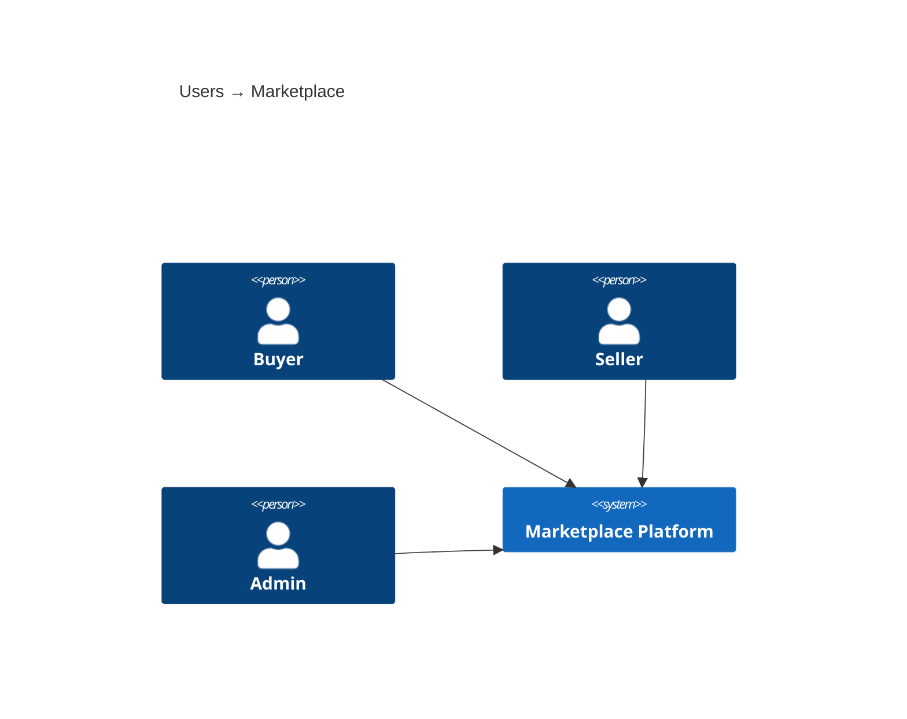
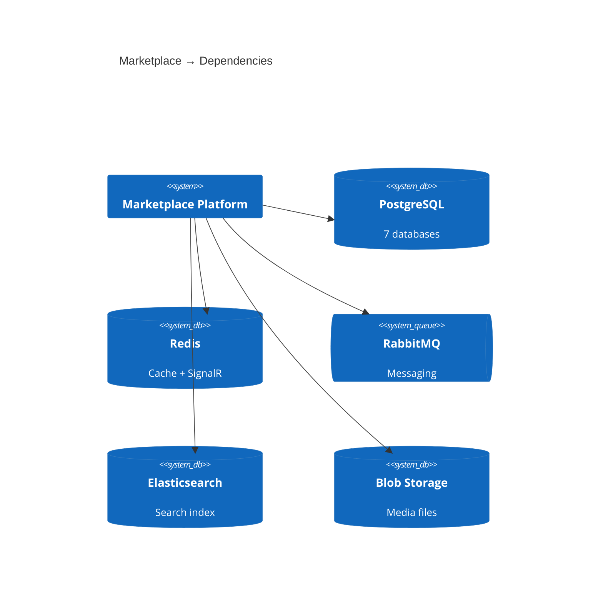

# C4 Context — Marketplace Microservices Platform

## System Overview

**Short Description:** Multi-vendor e-commerce marketplace platform built with .NET 10 microservices, Angular 19 frontend, and .NET Aspire orchestration.

**Long Description:** The Marketplace platform enables multiple sellers to list products, buyers to browse/search/purchase items, and the system to orchestrate the full order lifecycle from cart checkout through payment completion. It implements Domain-Driven Design with CQRS, database-per-service isolation, and event-driven communication via MassTransit (RabbitMQ). The Ordering service acts as a saga orchestrator coordinating inventory reservation, payment processing, and compensation flows.

---

## Personas

| Persona | Type | Description | Goals | Key Features |
|---------|------|-------------|-------|--------------|
| Buyer | Human | Browses, searches, purchases products | Find products, place orders, track delivery | Catalog, search, cart, checkout, orders, notifications |
| Seller | Human | Lists and manages products, fulfills orders | List products, manage inventory, view sales | Dashboard, product CRUD, order management, store profile |
| Admin | Human | Manages users, stores, and platform health | Verify stores, manage users | User management, store verification |
| Angular SPA | Programmatic | Browser frontend via API Gateway | Render UI, proxy API calls | All features via BFF cookie auth |
| SignalR Clients | Programmatic | WebSocket for real-time updates | Receive order status notifications | Order status push |

---

## System Features

| Feature | Description | Users |
|---------|-------------|-------|
| Product Catalog | Browse, search, filter with category tree and facets | Buyer, Seller |
| Shopping Cart | Add/remove items, persist cart, checkout | Buyer |
| Order Processing | Saga-orchestrated: inventory → payment → completion | Buyer, Seller |
| Inventory Management | Stock tracking, reservation, release | Seller, System |
| Payment Processing | Simulated gateway with completion/failure | System |
| Real-time Notifications | SignalR pushes order status updates | Buyer, Seller |
| Store Management | Store creation, admin verification, role promotion | Seller, Admin |
| Media Storage | Product image upload via blob storage | Seller |
| Search & Discovery | Elasticsearch full-text search with facets | Buyer |
| User Identity | Registration, login, JWT auth, RBAC | All |

---

## User Journeys

### Buyer: Browse to Purchase

```
1. Visit marketplace → Angular SPA loads via API Gateway
2. Browse catalog → GET /api/catalog/products
3. Search products → GET /api/search/products
4. View product → GET /api/catalog/products/{id}
5. Add to cart → POST /api/cart/items
6. Checkout → POST /api/cart/checkout
   └── Cart → OrderSubmittedEvent → Ordering Saga
       └── ReserveInventory → ProcessPayment → Complete
7. Real-time updates → SignalR pushes status changes
8. View orders → GET /api/orders/buyer/{buyerId}
```

### Seller: List and Fulfill

```
1. Register → POST /api/identity/auth/register
2. Create store → POST /api/stores/
3. Admin verifies → StoreVerifiedEvent → role promoted to Seller
4. Create product → POST /api/catalog/products/
   └── ProductCreatedEvent → Search indexes, Inventory inits, Cart syncs
5. Manage stock → POST /api/inventory/items/{sku}/add-stock
6. View orders → GET /api/orders/seller/{sellerId}
7. Update status → PUT /api/orders/{id}/status
```

---

## External Systems

| System | Type | Purpose | Integration |
|--------|------|---------|-------------|
| PostgreSQL | Database | 7 per-service databases | EF Core |
| Redis | Cache | Cart cache + SignalR backplane | StackExchange.Redis |
| RabbitMQ | Broker | Async messaging | MassTransit |
| Elasticsearch | Search | Product search index | NEST |
| Azure Blob | Storage | Media files | Azure SDK |

---

## System Context Diagrams

### Diagram 1: Users → Platform



### Diagram 2: Platform → External Systems



**Dependency details:**

| System | Protocol | Used By |
|--------|----------|---------|
| PostgreSQL | EF Core / Npgsql | Identity, Catalog, Ordering, Inventory, Cart, Payment, Store |
| Redis | StackExchange.Redis | Cart (cache), Notification (backplane) |
| RabbitMQ | MassTransit | All services (events + commands) |
| Elasticsearch | NEST | Search.API |
| Azure Blob | Azure SDK | Media.API |

---

## Related Documentation

- [Container Documentation](c4-container.md) — Deployment containers and API specifications
- [Component Documentation](c4-component.md) — Component-level details and interfaces
- [Interaction Diagram](c4-interaction-diagram.md) — Service-to-service communication details
