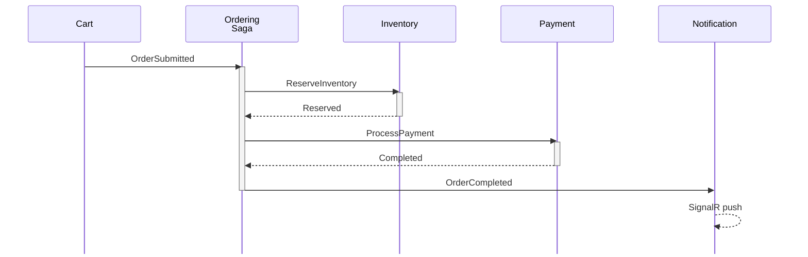
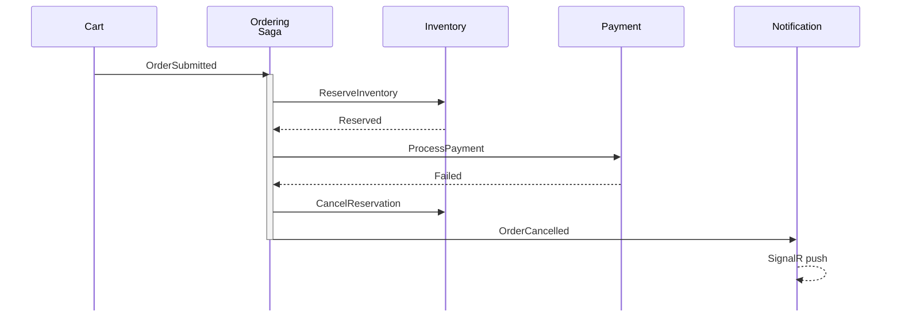
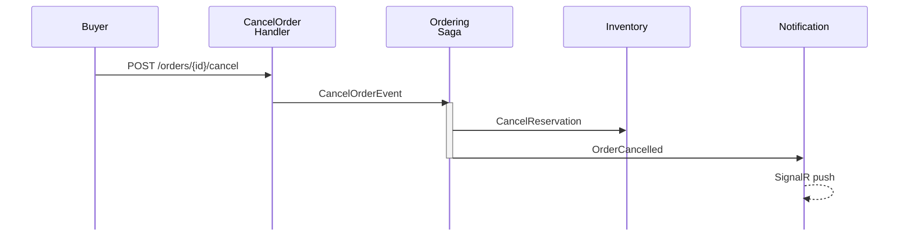
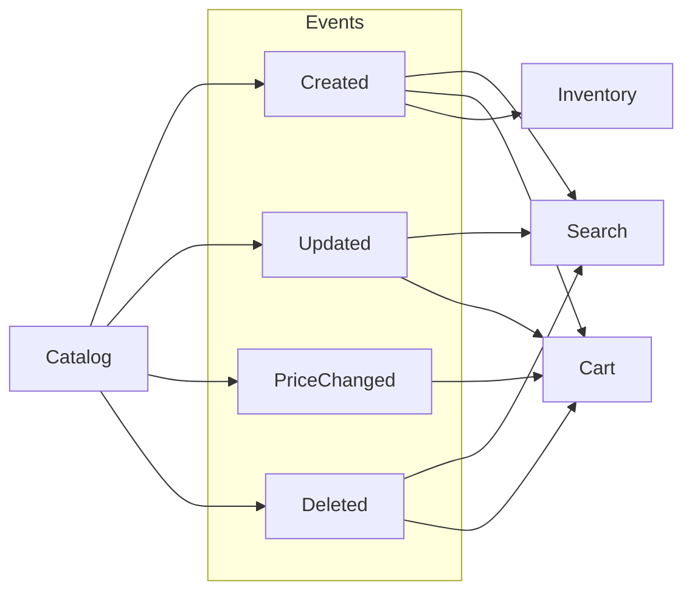
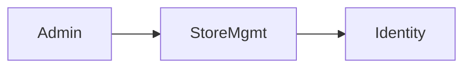
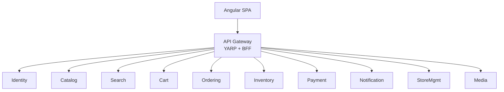
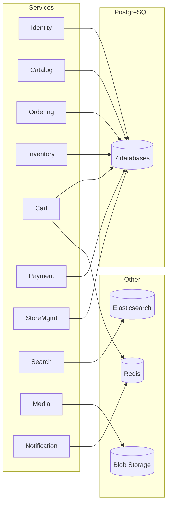

# Microservice Interaction Diagram — Marketplace Platform

## Overview

This document maps every service-to-service interaction in the Marketplace platform. Communication falls into two categories:

1. **Asynchronous (MassTransit / RabbitMQ)** — Event-driven, eventual consistency, saga orchestration
2. **Synchronous (HTTP via YARP)** — Request/response through API Gateway

---

## Diagram 1: Checkout Saga Flow (Success Path)

---

## Diagram 2: Checkout Saga (Compensation / Failure)

---

## Diagram 3: Buyer-Initiated Cancellation (Plan 11)

---

## Diagram 4: Product Event Fan-Out

| Event | Search | Cart | Inventory |
|-------|--------|------|-----------|
| ProductCreated | Index in ES | Sync price | Init stock (0) |
| ProductUpdated | Reindex | Sync price | — |
| ProductPriceChanged | — | Update price | — |
| ProductDeleted | Remove | Remove price | — |

---

## Diagram 5: Store → Identity Role Promotion

| Step | Action |
|------|--------|
| 1 | Admin: `POST /api/stores/{id}/verify` |
| 2 | StoreMgmt publishes `StoreVerifiedIntegrationEvent` |
| 3 | Identity consumer promotes user: Buyer → Seller |

---

## Diagram 6: Gateway Routing

| Route | Target | Auth |
|-------|--------|------|
| `/api/identity/**` | Identity | Public + Auth |
| `/api/catalog/**` | Catalog | Public + Auth |
| `/api/search/**` | Search | Public |
| `/api/cart/**` | Cart | Auth |
| `/api/orders/**` | Ordering | Auth |
| `/api/inventory/**` | Inventory | Auth |
| `/api/payments/**` | Payment | Auth |
| `/hubs/**` | Notification | SignalR |
| `/api/stores/**` | StoreMgmt | Public + Auth |
| `/api/media/**` | Media | Public + Auth |

---

## Diagram 7: Data Store Mapping

| Service | Store | Database |
|---------|-------|----------|
| Identity | PostgreSQL | identity-db |
| Catalog | PostgreSQL | catalog-db |
| Ordering | PostgreSQL | ordering-db + saga state |
| Inventory | PostgreSQL | inventory-db |
| Cart | PostgreSQL + Redis | cart-db + cache |
| Payment | PostgreSQL | payment-db |
| StoreMgmt | PostgreSQL | store-db |
| Search | Elasticsearch | marketplace-products |
| Media | Azure Blob | media container |
| Notification | Redis | SignalR backplane |

---

## Full Event/Command Reference

### Commands (point-to-point)

| Command | Producer | Consumer | Purpose |
|---------|----------|----------|---------|
| ReserveInventoryCommand | Ordering | Inventory | Reserve stock |
| CancelReservationCommand | Ordering | Inventory | Release stock |
| ProcessPaymentCommand | Ordering | Payment | Process payment |

### Events (pub/sub)

| Event | Producer | Consumers |
|-------|----------|-----------|
| OrderSubmitted | Cart | Ordering |
| InventoryReserved | Inventory | Ordering |
| InventoryFailed | Inventory | Ordering |
| InventoryReleased | Inventory | *(none)* |
| PaymentCompleted | Payment | Ordering |
| PaymentFailed | Payment | Ordering |
| OrderCompleted | Ordering | Notification |
| OrderCancelled | Ordering | Notification |
| CancelOrder | Ordering (handler) | Ordering (saga) |
| OrderStatusChanged | Ordering | Notification |
| ProductCreated | Catalog | Search, Cart, Inventory |
| ProductUpdated | Catalog | Search, Cart |
| ProductPriceChanged | Catalog | Cart |
| ProductDeleted | Catalog | Search, Cart |
| UserRegistered | Identity | *(none)* |
| StoreVerified | StoreMgmt | Identity |

---

## Interaction Patterns

| Pattern | Where | Description |
|---------|-------|-------------|
| Saga Orchestrator | Ordering → Inventory → Payment | Multi-step with compensation |
| Fan-Out | Catalog → Search, Cart, Inventory | One event, three consumers |
| CQRS Projection | Ordering saga → projections | Saga state → read model |
| Outbox | All publishers | EF Core Outbox + RabbitMQ |
| BFF | API Gateway | Cookie-to-bearer auth |
| Compensation | Saga on failure/cancel | CancelReservationCommand |

---

## Related Documentation

- [Context Diagram](c4-context.md) — System context with personas
- [Container Diagram](c4-container.md) — Deployment containers and APIs
- [Component Index](c4-component.md) — All 31 components
