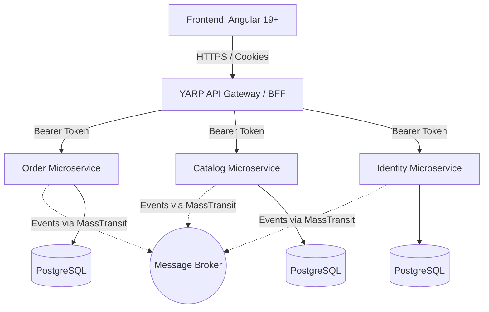

# Enterprise Marketplace Microservices Platform

[](https://github.com/Movchanets/Microservices/actions/workflows/ci.yml)

## Overview
This codebase implements an Enterprise Marketplace platform designed as a highly scalable, distributed microservices system. It solves the problem of building a robust, maintainable e-commerce ecosystem by providing strict bounded context isolation, clean architecture boundaries, and an event-driven approach. This ensures that the core domain remains completely independent of infrastructure concerns, allowing independent teams to develop, test, and deploy services autonomously.

## Architecture
The system follows Domain-Driven Design (DDD) principles with a Database-per-Service pattern. Internally, services utilize Clean Architecture and CQRS (via MediatR) to separate read and write models. Inter-service communication is primarily asynchronous, leveraging MassTransit with RabbitMQ or Azure Service Bus. External requests are routed through a YARP-based API Gateway functioning as a Backend-For-Frontend (BFF), which handles cookie-to-bearer token transformation for secure, stateless client interactions.

## Mermaid Diagram



## Quick Start

### Prerequisites
- [.NET 10 SDK](https://dotnet.microsoft.com/download/dotnet/10.0) (Version specified in `global.json`)

### Commands
To install dependencies, build the codebase, and run the tests, execute the following commands from the repository root:

```bash
# Restore all dependencies for the solution
dotnet restore Marketplace.slnx

# Build the solution
dotnet build Marketplace.slnx --no-restore

# Run unit tests
dotnet test Marketplace.slnx --no-build
```
