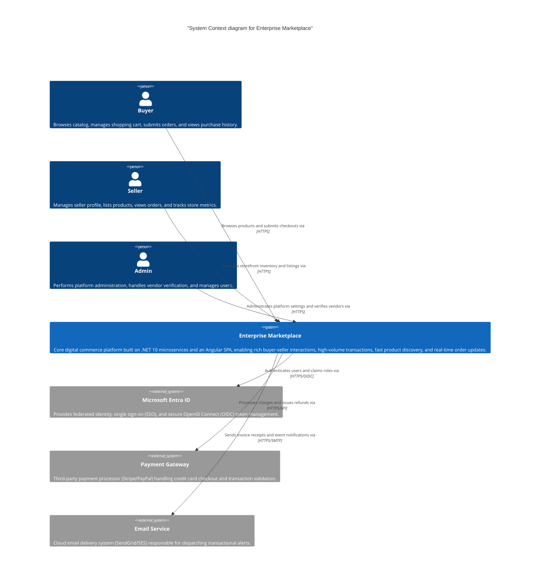
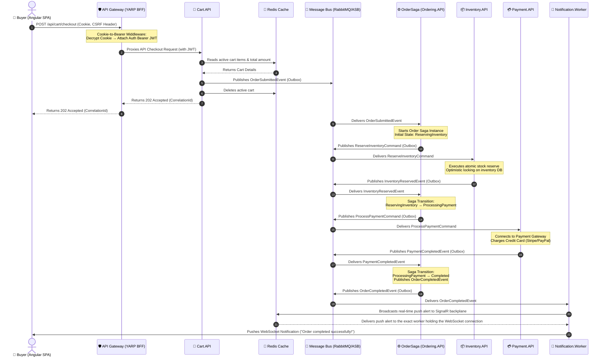

# C4 Architecture Diagrams

> **Last Updated:** 2026-06-19

This document contains standard C4 architecture diagrams for the Enterprise Marketplace Platform rendered as Mermaid diagrams.

---

## Level 1 — System Context

High-level, business-oriented view showing human users (Personas) and third-party integration boundaries.



---

## Level 2 — Container Diagram

Decomposition of the platform into deployment units, databases, message brokers, and communication protocols.

```mermaid
C4Container
    title "Container Diagram for Enterprise Marketplace Platform"

    Person(buyer, "Buyer", "Browses products and completes purchases.")
    Person(seller, "Seller", "Manages store profiles and inventories.")
    Person(admin, "Admin", "Administrates platform configuration and users.")

    System_Boundary(mkt_boundary, "Enterprise Marketplace Platform") {
        Container(spa, "Angular SPA", "Angular 19, Spartan/UI, Tailwind CSS", "Modern single-page application. Executes in-browser, rendering sleek reactive interfaces with Signals and NgRx SignalStore.")
        Container(gateway, "API Gateway / BFF", "YARP, ASP.NET Core 10", "Backend-For-Frontend gateway. Decrypts HttpOnly session cookies into Bearer tokens, protects against CSRF, and proxies routes to internal services.")
        
        Container(identity, "Identity.API", "ASP.NET Core 10, OIDC", "Manages user registrations, accounts, credentials, claims, and role assignments.")
        Container(catalog, "Catalog.API", "ASP.NET Core 10, EF Core 10", "Maintains catalog hierarchies, pricing, categories, and attributes. Publishes product update events.")
        Container(search, "Search.API", "ASP.NET Core 10, Nest", "Handles faceted full-text search. Synced with Catalog via RabbitMQ/ASB subscription.")
        Container(cart, "Cart.API", "ASP.NET Core 10, StackExchange.Redis", "Stateless API orchestrating temporary shopping carts stored in Redis.")
        Container(inventory, "Inventory.API", "ASP.NET Core 10, EF Core 10", "Handles stock allocations and reservations with optimistic locking invariants.")
        Container(ordering, "Ordering.API", "ASP.NET Core 10, MassTransit Saga", "Orchestrates order states using MassTransit Automatonymous state machines and Outbox pattern.")
        Container(payment, "Payment.API", "ASP.NET Core 10, EF Core 10", "Initiates payments, records transaction results, and handles webhooks.")
        Container(store, "StoreManagement.API", "ASP.NET Core 10, EF Core 10", "Registers seller profiles, handles vendor onboarding, and verifies storefront setups.")
        Container(media, "Media.API", "ASP.NET Core 10", "Stores and retrieves binary assets (product images, seller documents) using Azure Blobs.")
        Container(notification, "Notification.Worker", "ASP.NET Core 10 Worker, SignalR", "Pushes real-time alerts to active client SignalR connections using a Redis backplane.")

        ContainerDb(identity_db, "Identity DB", "PostgreSQL", "Dedicated database storing logins, roles, and user state.")
        ContainerDb(catalog_db, "Catalog DB", "PostgreSQL", "Dedicated database storing categories, options, and product tables.")
        ContainerDb(search_es, "Elasticsearch Index", "Elasticsearch Cluster", "Faceted indexing database of searchable product data.")
        ContainerDb(cart_redis, "Cart Cache", "Redis", "High-performance memory store caching active shopping carts.")
        ContainerDb(inventory_db, "Inventory DB", "PostgreSQL", "Dedicated database storing stock quantities and reservation logs.")
        ContainerDb(ordering_db, "Ordering DB", "PostgreSQL", "Dedicated database storing orders, historical records, and Saga state.")
        ContainerDb(payment_db, "Payment DB", "PostgreSQL", "Dedicated database storing payment transactions and invoice ledgers.")
        ContainerDb(store_db, "Store DB", "PostgreSQL", "Dedicated database storing seller setups and verification statuses.")
        ContainerDb(media_storage, "Blob Storage", "Azure Blob / Azurite", "Unstructured container store for product images and seller uploads.")
        ContainerDb(redis_backplane, "Redis Backplane", "Redis", "Shared SignalR backplane enabling horizontal scaling for notification push.")
        Container_Queue(msg_bus, "Message Bus", "MassTransit (RabbitMQ / Azure SB)", "Reliable event-driven integration transport broker coordinating eventual consistency.")
    }

    System_Ext(entra, "Microsoft Entra ID", "Identity Provider via OIDC protocol")
    System_Ext(stripe, "Payment Gateway", "Stripe / PayPal API services")
    System_Ext(email, "Email Service", "SendGrid / SES cloud delivery")

    Rel(buyer, spa, "Interacts with UI in browser", "HTTPS")
    Rel(seller, spa, "Interacts with UI in browser", "HTTPS")
    Rel(admin, spa, "Interacts with UI in browser", "HTTPS")

    Rel(spa, gateway, "Sends requests to", "HTTPS + HttpOnly Session Cookie")
    Rel(gateway, spa, "Establishes realtime push stream", "WebSockets / SignalR")

    Rel(gateway, identity, "Routes with Bearer JWT to", "HTTPS / ASP.NET Core")
    Rel(gateway, catalog, "Routes with Bearer JWT to", "HTTPS / ASP.NET Core")
    Rel(gateway, search, "Routes with Bearer JWT to", "HTTPS / ASP.NET Core")
    Rel(gateway, cart, "Routes with Bearer JWT to", "HTTPS / ASP.NET Core")
    Rel(gateway, inventory, "Routes with Bearer JWT to", "HTTPS / ASP.NET Core")
    Rel(gateway, ordering, "Routes with Bearer JWT to", "HTTPS / ASP.NET Core")
    Rel(gateway, payment, "Routes with Bearer JWT to", "HTTPS / ASP.NET Core")
    Rel(gateway, store, "Routes with Bearer JWT to", "HTTPS / ASP.NET Core")
    Rel(gateway, media, "Routes with Bearer JWT to", "HTTPS / ASP.NET Core")
    Rel(gateway, notification, "Proxies websocket stream with affinity to", "WebSockets / WSS")

    Rel_D(identity, identity_db, "Reads/writes", "EF Core 10 / SQL")
    Rel_D(catalog, catalog_db, "Reads/writes", "EF Core 10 / SQL")
    Rel_D(search, search_es, "Reads/writes", "Elasticsearch API")
    Rel_D(cart, cart_redis, "Reads/writes", "Redis Serialization")
    Rel_D(inventory, inventory_db, "Reads/writes", "EF Core 10 / SQL")
    Rel_D(ordering, ordering_db, "Reads/writes", "EF Core 10 / SQL")
    Rel_D(payment, payment_db, "Reads/writes", "EF Core 10 / SQL")
    Rel_D(store, store_db, "Reads/writes", "EF Core 10 / SQL")
    Rel_D(media, media_storage, "Uploads/downloads", "Azure SDK / HTTPS")
    Rel_D(notification, redis_backplane, "Pub/sub sticky broadcasts via", "Redis CLI")

    Rel_R(identity, entra, "Redirects auth validation to", "HTTPS / OIDC")
    Rel_R(payment, stripe, "Initiates charge transactions with", "HTTPS / REST API")
    Rel_L(notification, email, "Dispatches alerts via", "HTTPS / SMTP")

    Rel(catalog, msg_bus, "Publishes product state changes to", "MassTransit Outbox")
    Rel(search, msg_bus, "Subscribes and updates indexes from", "MassTransit Consumers")
    Rel(cart, msg_bus, "Publishes OrderSubmittedEvent to", "MassTransit")
    Rel(ordering, msg_bus, "Orchestrates commands/events to", "MassTransit Outbox")
    Rel(inventory, msg_bus, "Processes commands and publishes events to", "MassTransit Outbox")
    Rel(payment, msg_bus, "Processes commands and publishes events to", "MassTransit Outbox")
    Rel(notification, msg_bus, "Listens to events from", "MassTransit Consumers")
```

---

## Level 3 — Component Diagram (Ordering.API)

Internal architecture of the `Ordering.API` microservice showcasing Clean Architecture, MediatR CQRS, and MassTransit Saga state machine.

```mermaid
C4Component
    title "Component Diagram for Ordering.API Container"

    Container(gateway, "API Gateway / BFF", "YARP, ASP.NET Core 10", "Reverse Proxy routing user orders requests.")
    Container_Queue(msg_bus, "Message Bus", "MassTransit (RabbitMQ / Azure SB)", "Enterprise asynchronous messaging integration.")

    Container_Boundary(ordering_container, "Ordering.API (Clean Architecture)") {
        
        Boundary(presentation, "Presentation Layer") {
            Component(endpoints, "OrderEndpoints", "Minimal APIs", "Maps HTTP POST/GET/DELETE routes. Triggers MediatR requests and returns standard ASP.NET Core Results.")
        }

        Boundary(application, "Application Layer") {
            Component(mediator, "MediatR ISender", "MediatR", "Handles in-process dispatching of commands, queries, and notification behaviors.")
            
            Component(val_behavior, "ValidationBehavior", "MediatR PipelineBehavior", "Executes FluentValidation checks on incoming Command record objects before execution.")
            Component(log_behavior, "LoggingBehavior", "MediatR PipelineBehavior", "Logs commands/queries boundaries, performance metrics, and exceptions.")
            Component(tx_behavior, "TransactionBehavior", "MediatR PipelineBehavior", "Orchestrates SQL transactions around write Command executions.")

            Component(create_handler, "CreateOrderHandler", "MediatR Command Handler", "Processes Order aggregate creation, adding items and persisting to repository.")
            Component(cancel_handler, "CancelOrderHandler", "MediatR Command Handler", "Retrieves Order aggregate, fires cancellation logic, and updates repository.")
            Component(get_handler, "GetOrderByIdHandler", "MediatR Query Handler", "Queries specific Order details from DB using high-speed non-tracking queries.")
            Component(list_handler, "ListOrdersHandler", "MediatR Query Handler", "Lists/filters Orders for a given Buyer/Seller, with pagination.")
        }

        Boundary(domain, "Domain Layer (Zero Dependencies)") {
            Component(order_aggregate, "Order AggregateRoot", "Domain Entity", "Defines consistency boundaries, state transitions (Submitted, Completed, Cancelled), and item invariants.")
            Component(order_item, "OrderItem Entity", "Domain Entity", "Represents an individual purchased SKU, quantity, and verified transaction price.")
            Component(address_vo, "Address ValueObject", "Value Object", "Immutable record of buyer billing/shipping destination (equality by value).")
            Component(domain_events, "Domain Events", "MediatR INotification", "In-process notifications (OrderCreated, OrderCancelled) dispatched upon changes.")
        }

        Boundary(infrastructure, "Infrastructure Layer") {
            Component(repository, "OrderRepository", "EF Core 10", "Implements IOrderRepository, abstracting DB operations behind clean Domain interfaces.")
            ComponentDb(db_context, "OrderDbContext", "EF Core 10, PostgreSQL", "Aggregates-to-SQL mapping config, database context, and Outbox schema store.")
            
            Component(saga_sm, "OrderStateMachine", "MassTransit Saga State", "State machine orchestrating the Checkout Saga. Persists state details within OrderDbContext.")
            
            Component(inv_reserved, "InventoryReservedConsumer", "MassTransit Consumer", "Listens for stock allocation success. Triggers Payment execution in state machine.")
            Component(inv_failed, "InventoryReservationFailedConsumer", "MassTransit Consumer", "Listens for stock depletion. Triggers compensating rollbacks.")
            Component(pay_completed, "PaymentCompletedConsumer", "MassTransit Consumer", "Listens for checkout payment success. Completes Saga.")
            Component(pay_failed, "PaymentFailedConsumer", "MassTransit Consumer", "Listens for card payment decline. Initiates compensation logic.")
        }
    }

    Rel(gateway, endpoints, "Sends API requests to", "JSON/HTTPS")
    Rel(endpoints, mediator, "Dispatches Requests to", "In-Process")
    
    Rel(mediator, val_behavior, "Intercepts Commands via", "In-Process Pipeline")
    Rel(val_behavior, log_behavior, "Intercepts Commands via", "In-Process Pipeline")
    Rel(log_behavior, tx_behavior, "Intercepts Commands via", "In-Process Pipeline")

    Rel(tx_behavior, create_handler, "Dispatches Command to", "In-Process")
    Rel(tx_behavior, cancel_handler, "Dispatches Command to", "In-Process")
    Rel(mediator, get_handler, "Dispatches Query to", "In-Process")
    Rel(mediator, list_handler, "Dispatches Query to", "In-Process")

    Rel(create_handler, order_aggregate, "Creates and configures", "C# Domain Types")
    Rel(cancel_handler, order_aggregate, "Triggers cancellation state transition in", "C# Domain Types")
    
    Rel(order_aggregate, order_item, "Contains 1..* collection of", "Composition")
    Rel(order_aggregate, address_vo, "Contains billing/shipping", "Composition")
    Rel(order_aggregate, domain_events, "Sparks side-effect events in", "In-Process Dispatch")

    Rel(create_handler, repository, "Persists state via", "C# Interface")
    Rel(cancel_handler, repository, "Updates state via", "C# Interface")
    Rel(get_handler, repository, "Reads details from", "C# Interface (AsNoTracking)")
    Rel(list_handler, repository, "Reads list from", "C# Interface (AsNoTracking)")
    
    Rel(repository, db_context, "Manages data reads/writes via", "EF Core 10")
    
    Rel(msg_bus, inv_reserved, "Delivers integration event", "MassTransit Queue")
    Rel(msg_bus, inv_failed, "Delivers integration event", "MassTransit Queue")
    Rel(msg_bus, pay_completed, "Delivers integration event", "MassTransit Queue")
    Rel(msg_bus, pay_failed, "Delivers integration event", "MassTransit Queue")

    Rel(inv_reserved, saga_sm, "Correlates state transition in", "MassTransit Saga API")
    Rel(inv_failed, saga_sm, "Correlates state transition in", "MassTransit Saga API")
    Rel(pay_completed, saga_sm, "Correlates state transition in", "MassTransit Saga API")
    Rel(pay_failed, saga_sm, "Correlates state transition in", "MassTransit Saga API")
    
    Rel(saga_sm, db_context, "Persists state machine state in", "EF Core Saga Repository")
    Rel(saga_sm, msg_bus, "Publishes commands & integration events via", "MassTransit Outbox")
```

---

## Data Flow — Order Checkout Saga Sequence

End-to-end distributed transaction checkout flow including YARP BFF session translation, Redis operations, MassTransit Saga orchestration, and SignalR push notification.



---

## Container Inventory

| Container | Technology | Database | Messaging |
|:---|:---|:---|:---|
| Angular SPA | Angular 19, Spartan/UI, Tailwind | — | — |
| API Gateway / BFF | YARP, ASP.NET Core 10 | — | — |
| Identity.API | ASP.NET Core 10, OIDC | PostgreSQL | — |
| Catalog.API | ASP.NET Core 10, EF Core 10 | PostgreSQL | MassTransit Outbox |
| Search.API | ASP.NET Core 10, Nest | Elasticsearch | MassTransit Consumer |
| Cart.API | ASP.NET Core 10, StackExchange.Redis | Redis | MassTransit |
| Inventory.API | ASP.NET Core 10, EF Core 10 | PostgreSQL | MassTransit Outbox |
| Ordering.API | ASP.NET Core 10, MassTransit Saga | PostgreSQL | MassTransit Outbox |
| Payment.API | ASP.NET Core 10, EF Core 10 | PostgreSQL | MassTransit Outbox |
| StoreManagement.API | ASP.NET Core 10, EF Core 10 | PostgreSQL | — |
| Media.API | ASP.NET Core 10 | Azure Blob / Azurite | — |
| Notification.Worker | ASP.NET Core 10 Worker, SignalR | — | MassTransit Consumer |

---

## External Dependencies

| System | Protocol | Purpose |
|:---|:---|:---|
| Microsoft Entra ID | HTTPS/OIDC | Federated identity, SSO, token management |
| Stripe / PayPal | HTTPS/REST API | Payment processing, refunds |
| SendGrid / SES | HTTPS/SMTP | Transactional email delivery |
