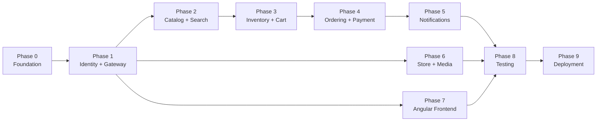

# 🚀 Implementation Plan — Enterprise Marketplace

Phased execution plan for building the microservices marketplace from the architectural blueprints in [`plans/`](../plans/).

## Phases Overview

| Phase | Name | Est. Duration | Dependencies |
|:---|:---|:---|:---|
| 0 | [Foundation & Aspire](./phase-0-foundation.md) | 1 week | — |
| 1 | [Identity & Gateway](./phase-1-identity-gateway.md) | 2 weeks | Phase 0 |
| 2 | [Catalog & Search](./phase-2-catalog-search.md) | 2 weeks | Phase 1 |
| 3 | [Inventory & Cart](./phase-3-inventory-cart.md) | 1.5 weeks | Phase 2 |
| 4 | [Ordering Saga & Payment](./phase-4-ordering-payment.md) | 2.5 weeks | Phase 3 |
| 5 | [Notifications & Real-time](./phase-5-notifications.md) | 1.5 weeks | Phase 4 |
| 6 | [Store Management & Media](./phase-6-store-media.md) | 1.5 weeks | Phase 2 |
| 7 | [Angular Frontend](./phase-7-frontend.md) | 3 weeks | Phase 1–6 (incremental) |
| 8 | [Testing & Hardening](./phase-8-testing.md) | 2 weeks | Phase 7 |
| 9 | [Infrastructure & Deployment](./phase-9-deployment.md) | 1.5 weeks | Phase 8 |

## Dependency Graph

## Conventions

- Every task has a Trello card in the [Microservices board](https://trello.com/b/qUl75p1Q)
- Each microservice follows the [Clean Architecture template](../plans/03-clean-architecture.md)
- All integration events defined in `BuildingBlocks.SharedContracts`
- All services registered in `Marketplace.AppHost`
