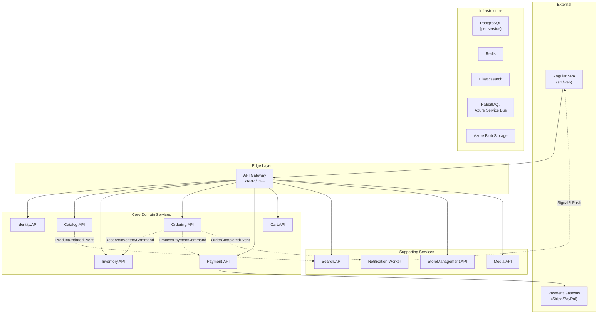

# 02 — Domain Decomposition

## Bounded Contexts & Microservice Topology

The marketplace is decomposed into narrowly specialized microservices, each responsible for its own bounded context.

## Service Catalogue

### ApiGateway
| Property | Value |
|:---|:---|
| **Path** | `src/Gateways/ApiGateway/` |
| **Tech** | YARP, ASP.NET Core 10 |
| **Role** | Single entry point, BFF, SSL termination, reverse proxy, cookie-to-bearer transform |
| **Database** | None (stateless) |

### Identity.API
| Property | Value |
|:---|:---|
| **Path** | `src/Microservices/Identity/Identity.API/` |
| **Tech** | PostgreSQL, OpenID Connect |
| **Role** | User management, authentication, authorization, JWT generation, roles (buyer, seller, admin) |
| **Database** | PostgreSQL (dedicated) |

### Catalog.API
| Property | Value |
|:---|:---|
| **Path** | `src/Microservices/Catalog/Catalog.API/` |
| **Tech** | PostgreSQL, EF Core 10 |
| **Role** | Product catalog, categories, pricing, attributes. Source of truth for product nomenclature |
| **Database** | PostgreSQL (dedicated) |
| **Publishes** | `ProductCreatedEvent`, `ProductUpdatedEvent`, `ProductDeletedEvent` |

### Search.API
| Property | Value |
|:---|:---|
| **Path** | `src/Microservices/Search/Search.API/` |
| **Tech** | Elasticsearch, ASP.NET Core |
| **Role** | Full-text search, faceted filtering. Syncs with Catalog via integration events |
| **Database** | Elasticsearch index |
| **Consumes** | `ProductUpdatedEvent`, `ProductCreatedEvent`, `ProductDeletedEvent` |

### Inventory.API
| Property | Value |
|:---|:---|
| **Path** | `src/Microservices/Inventory/Inventory.API/` |
| **Tech** | PostgreSQL, EF Core 10 |
| **Role** | Isolated stock reservations, optimistic locking. Prevents overselling |
| **Database** | PostgreSQL (dedicated) |
| **Consumes** | `ReserveInventoryCommand`, `CancelReservationCommand` |
| **Publishes** | `InventoryReservedEvent`, `InventoryReservationFailedEvent`, `InventoryReleasedEvent` |

### Cart.API
| Property | Value |
|:---|:---|
| **Path** | `src/Microservices/Cart/Cart.API/` |
| **Tech** | Redis (Aspire.Hosting.Redis) |
| **Role** | Stateless service using Redis for temporary shopping cart state. Ultra-low latency |
| **Database** | Redis |
| **Publishes** | `OrderSubmittedEvent` |

### Ordering.API
| Property | Value |
|:---|:---|
| **Path** | `src/Microservices/Ordering/Ordering.API/` |
| **Tech** | PostgreSQL, MassTransit Sagas |
| **Role** | Order lifecycle orchestration. Hosts `OrderStateMachine` saga for coordinating reservation and payment |
| **Database** | PostgreSQL (dedicated, including saga state) |
| **Consumes** | `OrderSubmittedEvent`, `InventoryReservedEvent`, `InventoryReservationFailedEvent`, `PaymentCompletedEvent`, `PaymentFailedEvent` |
| **Publishes** | `ReserveInventoryCommand`, `ProcessPaymentCommand`, `CancelReservationCommand`, `OrderCompletedEvent`, `OrderCancelledEvent` |

### Payment.API
| Property | Value |
|:---|:---|
| **Path** | `src/Microservices/Payment/Payment.API/` |
| **Tech** | PostgreSQL, External Gateways |
| **Role** | External payment provider integration, transaction processing |
| **Database** | PostgreSQL (dedicated) |
| **Consumes** | `ProcessPaymentCommand` |
| **Publishes** | `PaymentCompletedEvent`, `PaymentFailedEvent` |

### StoreManagement.API
| Property | Value |
|:---|:---|
| **Path** | `src/Microservices/StoreManagement/StoreManagement.API/` |
| **Tech** | PostgreSQL, EF Core 10 |
| **Role** | Seller profiles, store settings, vendor verification |
| **Database** | PostgreSQL (dedicated) |

### Media.API
| Property | Value |
|:---|:---|
| **Path** | `src/Microservices/Media/Media.API/` |
| **Tech** | Aspire.Azure.Storage.Blobs |
| **Role** | Image/media storage and processing. Uses Azurite locally, Azure Blob Storage in cloud |
| **Database** | Azure Blob Storage |

### Notification.Worker
| Property | Value |
|:---|:---|
| **Path** | `src/Microservices/Notification/Notification.Worker/` |
| **Tech** | MassTransit, SignalR, Redis |
| **Role** | Background consumer that listens to domain events and delivers push notifications via WebSocket |
| **Database** | None (uses Redis for SignalR backplane) |
| **Consumes** | `OrderCompletedEvent`, `PaymentFailedEvent`, and other domain events |

## Cross-Service Communication Matrix

| From → To | Protocol | Event/Command |
|:---|:---|:---|
| Cart → Ordering | Message Bus | `OrderSubmittedEvent` |
| Ordering → Inventory | Message Bus | `ReserveInventoryCommand` |
| Inventory → Ordering | Message Bus | `InventoryReservedEvent` / `InventoryReservationFailedEvent` |
| Ordering → Payment | Message Bus | `ProcessPaymentCommand` |
| Payment → Ordering | Message Bus | `PaymentCompletedEvent` / `PaymentFailedEvent` |
| Ordering → Inventory | Message Bus | `CancelReservationCommand` (compensation) |
| Ordering → Notification | Message Bus | `OrderCompletedEvent` |
| Payment → Notification | Message Bus | `PaymentFailedEvent` |
| Catalog → Search | Message Bus | `ProductUpdatedEvent` / `ProductCreatedEvent` |
| Notification → Client | WebSocket | SignalR push notification |
