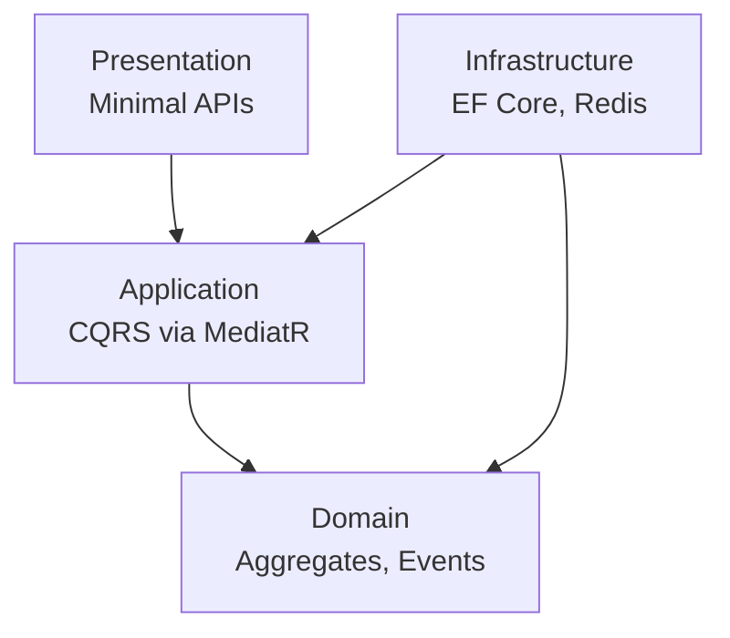
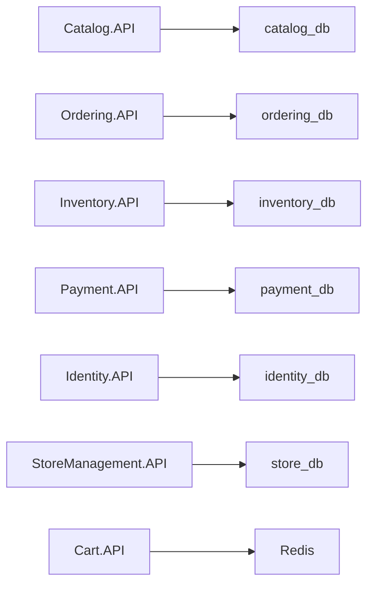

# 03 — Clean Architecture, DDD & CQRS

## Overview

Every microservice in `src/Microservices/*` follows Clean Architecture. The business logic core (Domain) has zero dependencies on infrastructure.

## Layer Diagram



> **Dependency Rule**: Dependencies always point inward. Domain has zero external references.

## Layers

### 1. Domain Layer (innermost)
- **Aggregates** — Transactional consistency boundaries
- **Entities** — Objects with identity and lifecycle
- **Value Objects** — Immutable, equality by value
- **Domain Events** — Side-effect triggers
- No references to EF Core, MassTransit, or any framework
- Use C# 14 `field` keyword for property validation

### 2. Application Layer
- **Commands** (write) / **Queries** (read) via MediatR
- **Handlers** — Use-case orchestration
- **DTOs** and repository abstractions (interfaces only)
- **Pipeline Behaviors**: Validation → Logging → Transaction → Handler

### 3. Infrastructure Layer
- EF Core DbContext, configurations, migrations
- Repository implementations
- MassTransit consumers, external API clients
- Each service has its own isolated PostgreSQL database

### 4. Presentation Layer (outermost)
- ASP.NET Core Minimal API endpoints
- Maps HTTP → MediatR → HTTP response
- Zero business logic

## Project Structure per Microservice

```
src/Microservices/{ServiceName}/
├── {Name}.Domain/
│   ├── Aggregates/
│   ├── Entities/
│   ├── ValueObjects/
│   ├── Events/
│   └── Enumerations/
├── {Name}.Application/
│   ├── Commands/{UseCase}/
│   │   ├── {UseCase}Command.cs
│   │   ├── {UseCase}Handler.cs
│   │   └── {UseCase}Validator.cs
│   ├── Queries/{UseCase}/
│   ├── DTOs/
│   ├── Abstractions/    (IRepository, IUnitOfWork)
│   └── Behaviors/       (Validation, Logging, Transaction)
├── {Name}.Infrastructure/
│   ├── Persistence/     (DbContext, Configurations, Migrations)
│   ├── Repositories/
│   └── Consumers/       (MassTransit)
└── {Name}.API/
    ├── Endpoints/
    ├── Program.cs
    └── appsettings.json
```

## Code Examples (C# 14.1)

### Domain — Aggregate with `field` keyword
```csharp
public sealed class Order : AggregateRoot
{
    public string BuyerId
    {
        get => field;
        init => field = !string.IsNullOrWhiteSpace(value)
            ? value : throw new DomainException("BuyerId required");
    }

    public OrderStatus Status { get; private set; } = OrderStatus.Submitted;
    private readonly List<OrderItem> _items = [];
    public IReadOnlyList<OrderItem> Items => _items.AsReadOnly();
}
```

### Application — Command + Handler
```csharp
public sealed record CreateOrderCommand(
    string BuyerId, List<OrderItemDto> Items) : IRequest<Result<Guid>>;

public sealed class CreateOrderHandler(
    IOrderRepository repository, IUnitOfWork uow)
    : IRequestHandler<CreateOrderCommand, Result<Guid>>
{
    public async Task<Result<Guid>> Handle(CreateOrderCommand req, CancellationToken ct)
    {
        var order = Order.Create(req.BuyerId);
        foreach (var item in req.Items)
            order.AddItem(item.ProductId, item.Price, item.Quantity);
        repository.Add(order);
        await uow.SaveChangesAsync(ct);
        return Result.Success(order.Id);
    }
}
```

### Presentation — Minimal API
```csharp
public static class OrderEndpoints
{
    public static void MapOrderEndpoints(this IEndpointRouteBuilder app)
    {
        var group = app.MapGroup("/api/orders").RequireAuthorization();
        group.MapPost("/", async (CreateOrderCommand cmd, ISender sender, CancellationToken ct) =>
        {
            var result = await sender.Send(cmd, ct);
            return result.IsSuccess
                ? Results.Created($"/api/orders/{result.Value}", result.Value)
                : Results.BadRequest(result.Error);
        });
    }
}
```

## Database-per-Service


