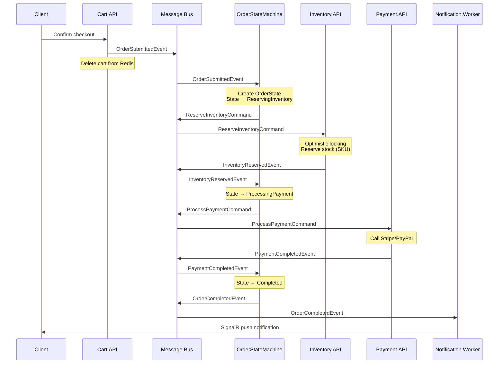
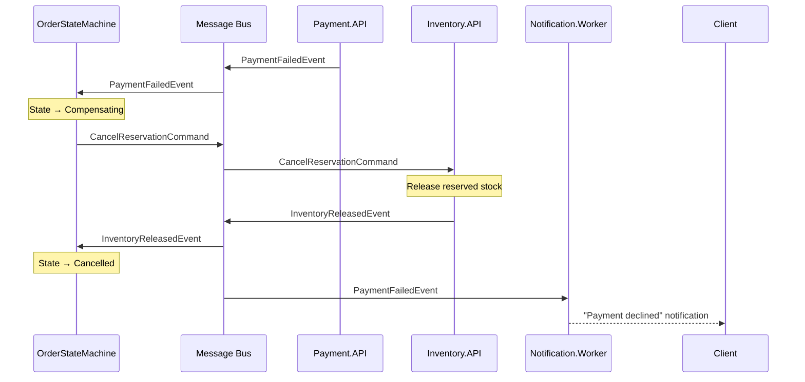

# 05 — Messaging, Sagas & Outbox Pattern

## Why Not ACID Across Services?

In Database-per-Service architecture, two-phase commit (2PC) is impractical — it blocks resources across databases, violates service autonomy, and degrades throughput. Instead, we use the **Saga pattern**.

## MassTransit + Automatonymous

All async communication and distributed transaction orchestration uses **MassTransit** with **Automatonymous State Machines**.

### Transport Configuration
| Environment | Broker |
|:---|:---|
| Local (.NET Aspire) | RabbitMQ (Docker container) |
| Production (ACA) | Azure Service Bus (Standard/Premium) |

## Order Saga — Happy Path



## Order Saga — Compensation (Payment Failed)



## State Machine Definition

```csharp
public sealed class OrderStateMachine : MassTransitStateMachine<OrderState>
{
    // States
    public State ReservingInventory { get; private set; } = null!;
    public State ProcessingPayment { get; private set; } = null!;
    public State Completed { get; private set; } = null!;
    public State Cancelled { get; private set; } = null!;
    public State Faulted { get; private set; } = null!;

    // Events
    public Event<OrderSubmittedEvent> OrderSubmitted { get; private set; } = null!;
    public Event<InventoryReservedEvent> InventoryReserved { get; private set; } = null!;
    public Event<InventoryReservationFailedEvent> InventoryFailed { get; private set; } = null!;
    public Event<PaymentCompletedEvent> PaymentCompleted { get; private set; } = null!;
    public Event<PaymentFailedEvent> PaymentFailed { get; private set; } = null!;

    public OrderStateMachine()
    {
        InstanceState(x => x.CurrentState);

        Event(() => OrderSubmitted, x => x.CorrelateById(ctx => ctx.Message.CorrelationId));
        Event(() => InventoryReserved, x => x.CorrelateById(ctx => ctx.Message.CorrelationId));
        Event(() => PaymentCompleted, x => x.CorrelateById(ctx => ctx.Message.CorrelationId));
        Event(() => PaymentFailed, x => x.CorrelateById(ctx => ctx.Message.CorrelationId));

        Initially(
            When(OrderSubmitted)
                .Then(ctx => { /* populate state */ })
                .Publish(ctx => new ReserveInventoryCommand(ctx.Saga.CorrelationId, ctx.Saga.Items))
                .TransitionTo(ReservingInventory));

        During(ReservingInventory,
            When(InventoryReserved)
                .Publish(ctx => new ProcessPaymentCommand(ctx.Saga.CorrelationId, ctx.Saga.TotalAmount))
                .TransitionTo(ProcessingPayment),
            When(InventoryFailed)
                .TransitionTo(Faulted));

        During(ProcessingPayment,
            When(PaymentCompleted)
                .Publish(ctx => new OrderCompletedEvent(ctx.Saga.CorrelationId))
                .TransitionTo(Completed),
            When(PaymentFailed)
                .Publish(ctx => new CancelReservationCommand(ctx.Saga.CorrelationId))
                .TransitionTo(Cancelled));
    }
}
```

## Outbox Pattern

**Problem**: Dual-write — saving to DB and publishing to broker are two separate operations. If one fails, data becomes inconsistent.

**Solution**: MassTransit Outbox writes messages to a DB table in the **same transaction** as the business entity. A background process reliably delivers them to the broker.

```
Save Order + Outbox Message → Same DB Transaction
Background Worker → Reads Outbox → Publishes to RabbitMQ/ASB
```

This guarantees **at-least-once delivery** and eliminates the dual-write problem.

### Configuration
```csharp
services.AddMassTransit(x =>
{
    x.AddSagaStateMachine<OrderStateMachine, OrderState>()
        .EntityFrameworkRepository(r =>
        {
            r.ExistingDbContext<OrderDbContext>();
            r.UsePostgres();
        });

    x.AddEntityFrameworkOutbox<OrderDbContext>(o =>
    {
        o.UsePostgres();
        o.UseBusOutbox();
    });

    x.UsingRabbitMq((context, cfg) =>
    {
        cfg.ConfigureEndpoints(context);
    });
});
```

## Integration Event Contracts

All contracts live in `src/BuildingBlocks/SharedContracts/`:

```csharp
// Events
public record OrderSubmittedEvent(Guid CorrelationId, string BuyerId, List<OrderItemContract> Items, DateTime Timestamp);
public record InventoryReservedEvent(Guid CorrelationId);
public record InventoryReservationFailedEvent(Guid CorrelationId, string Reason);
public record PaymentCompletedEvent(Guid CorrelationId, string TransactionId);
public record PaymentFailedEvent(Guid CorrelationId, string FailureReason);
public record OrderCompletedEvent(Guid CorrelationId);
public record InventoryReleasedEvent(Guid CorrelationId);
public record ProductUpdatedEvent(Guid ProductId, string Name, decimal Price, string Category);

// Commands
public record ReserveInventoryCommand(Guid CorrelationId, List<OrderItemContract> Items);
public record CancelReservationCommand(Guid CorrelationId);
public record ProcessPaymentCommand(Guid CorrelationId, decimal Amount);
```
