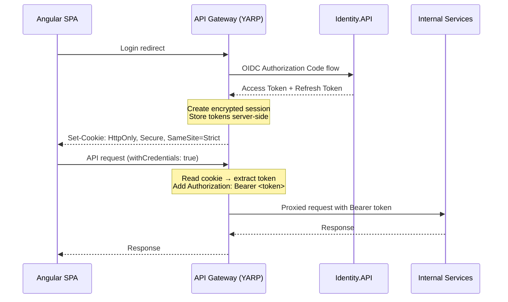

# 06 — API Gateway & BFF Pattern

## Overview

**YARP (Yet Another Reverse Proxy)** serves as the single entry point for all client traffic. It implements the **Backend-for-Frontend (BFF)** pattern to keep JWT tokens out of the browser.

## Architecture Flow



## Why BFF?

| Approach | XSS Risk | Token Location |
|:---|:---|:---|
| ❌ Token in localStorage | **High** — any XSS steals the token | Browser JavaScript |
| ❌ Token in sessionStorage | **High** — same risk | Browser JavaScript |
| ✅ BFF (HTTP-only cookie) | **None** — cookie inaccessible to JS | Server-side session |

## YARP Route Configuration

```json
{
  "ReverseProxy": {
    "Routes": {
      "catalogRoute": {
        "ClusterId": "catalogCluster",
        "Match": { "Path": "/api/catalog/{**catch-all}" }
      },
      "orderingRoute": {
        "ClusterId": "orderingCluster",
        "Match": { "Path": "/api/orders/{**catch-all}" }
      },
      "signalrRoute": {
        "ClusterId": "notificationCluster",
        "Match": { "Path": "/hubs/notifications/{**catch-all}" }
      }
    },
    "Clusters": {
      "catalogCluster": {
        "Destinations": {
          "catalog": { "Address": "http://catalog-api" }
        }
      },
      "notificationCluster": {
        "SessionAffinity": {
          "Enabled": true,
          "Policy": "HashCookie",
          "FailurePolicy": "Redistribute",
          "AffinityKeyName": "SignalR_Affinity"
        },
        "Destinations": {
          "notification": { "Address": "http://notification-worker" }
        }
      }
    }
  }
}
```

## Cookie-to-Bearer Middleware

```csharp
public class CookieToBearerMiddleware(RequestDelegate next)
{
    public async Task InvokeAsync(HttpContext context)
    {
        if (context.User.Identity?.IsAuthenticated == true)
        {
            var token = await context.GetTokenAsync("access_token");
            if (!string.IsNullOrEmpty(token))
            {
                context.Request.Headers.Authorization = $"Bearer {token}";
            }
        }
        await next(context);
    }
}
```

## CSRF Protection

Since we use cookies, Cross-Site Request Forgery protection is mandatory:
- Angular sends `X-XSRF-TOKEN` header from a non-HttpOnly cookie
- YARP validates the anti-forgery token on all mutating requests (POST/PUT/DELETE)
