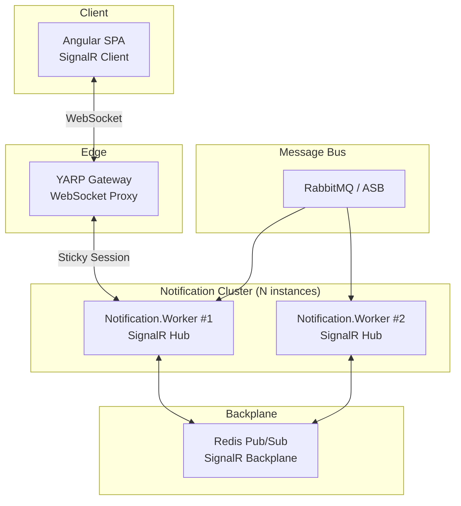

# 07 — Real-time Communication: SignalR & WebSockets

## Overview

The marketplace delivers instant push notifications (order status, payment results) via **ASP.NET Core SignalR** through WebSocket connections, all routed via YARP.

## Architecture



## The Scaling Problem

When `Notification.Worker` scales horizontally, a client may be connected to Instance #1, but an `OrderCompletedEvent` arrives at Instance #2. Without a backplane, Instance #2 cannot deliver the message.

## Solution: Redis Backplane

All instances connect to a shared Redis cluster. When any instance sends a message to a user, Redis broadcasts it to all instances. The instance holding the WebSocket connection performs the final delivery.

```csharp
// Notification.Worker — Program.cs
builder.Services.AddSignalR()
    .AddStackExchangeRedis(builder.Configuration.GetConnectionString("redis")!,
        options => { options.Configuration.ChannelPrefix = RedisChannel.Literal("marketplace"); });
```

## YARP Sticky Sessions

SignalR negotiation (HTTP) and upgrade (WebSocket) must hit the same backend instance:

```json
{
  "notificationCluster": {
    "SessionAffinity": {
      "Enabled": true,
      "Policy": "HashCookie",
      "FailurePolicy": "Redistribute",
      "AffinityKeyName": "SignalR_Affinity"
    }
  }
}
```

In Azure Container Apps, also enable: `affinity: "sticky"` on the Notification.Worker Ingress.

## Event Flow Example

1. `Payment.API` publishes `PaymentCompletedEvent` to bus
2. `Notification.Worker` (any instance) consumes the event
3. Worker calls `hubContext.Clients.User(buyerId).SendAsync("OrderUpdate", payload)`
4. Redis backplane routes to the instance holding the user's WebSocket
5. Client receives real-time push notification
