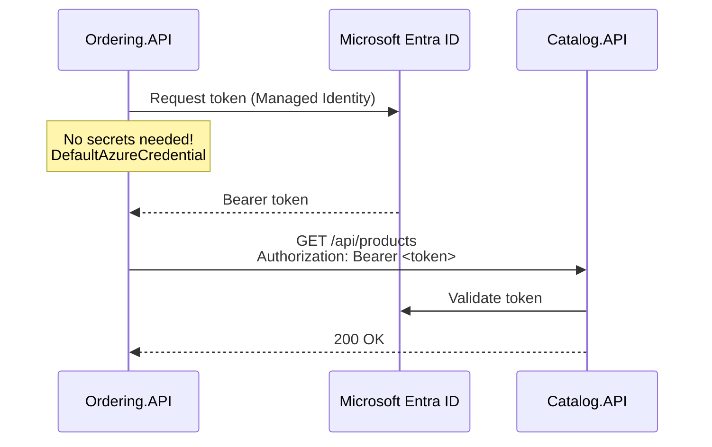

# 08 — Security Architecture

## Two Security Vectors

| Vector | Description | Solution |
|:---|:---|:---|
| **External** | Angular ↔ API Gateway | BFF pattern, HTTP-only cookies, CSRF |
| **Internal** | Service-to-Service (S2S) | Zero Trust, Managed Identities |

## External: BFF Security Flow

See [06-api-gateway-bff.md](./06-api-gateway-bff.md) for detailed BFF architecture.

**Key security attributes of the session cookie:**
- `HttpOnly` — Inaccessible to JavaScript (XSS protection)
- `Secure` — Only sent over HTTPS
- `SameSite=Strict` — CSRF protection at cookie level
- Encrypted server-side session

**Additional protections:**
- Anti-Forgery (CSRF) token validation on all mutating requests
- OIDC/OpenID Connect authentication flow via Identity.API
- Rate limiting on public API endpoints

## Internal: Zero Trust S2S Authentication

### Managed Identities in Azure Container Apps

Each microservice receives a **User-Assigned Managed Identity** during infrastructure provisioning. No secrets stored in config files.



### Code Pattern

```csharp
// Service making HTTP call — uses DefaultAzureCredential
services.AddHttpClient("CatalogApi", client =>
{
    client.BaseAddress = new Uri("http://catalog-api");
})
.AddDefaultAuthorizationHandler(); // Adds Managed Identity token

// Service receiving call — validates token
builder.Services.AddAuthentication(JwtBearerDefaults.AuthenticationScheme)
    .AddMicrosoftIdentityWebApi(builder.Configuration.GetSection("AzureAd"));
```

### Local Development Parity

`DefaultAzureCredential` automatically uses the developer's Azure CLI / Visual Studio credentials locally — same code, no environment-specific workarounds.

## Authentication Roles

| Role | Capabilities |
|:---|:---|
| **Buyer** | Browse catalog, manage cart, place orders, view order history |
| **Seller** | Manage products, view sales, configure store settings |
| **Admin** | User management, platform configuration, vendor verification |

## Security Checklist

- [ ] HTTP-only, Secure, SameSite=Strict cookies
- [ ] CSRF token validation on POST/PUT/DELETE
- [ ] JWT Bearer validation on all internal services
- [ ] Managed Identities for S2S — no secrets in config
- [ ] Rate limiting on public endpoints
- [ ] Input validation via FluentValidation
- [ ] SQL injection prevention via parameterized queries (EF Core)
- [ ] CORS restricted to allowed origins only
