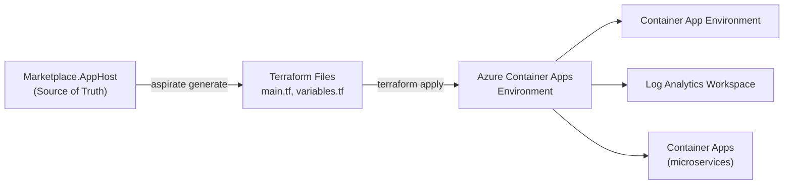
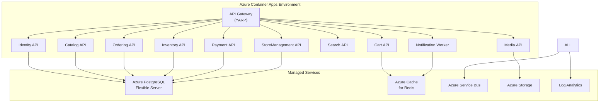
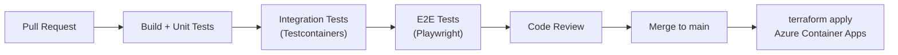

# 09 — Infrastructure & Deployment

## .NET Aspire — Single Source of Truth

The `Marketplace.AppHost` project is the single source of truth for both local development and cloud infrastructure generation.

### Local Development Stack

| Resource | Local Implementation |
|:---|:---|
| PostgreSQL | Docker container via `AddPostgres()` |
| Redis | Docker container via `AddRedis()` |
| RabbitMQ | Docker container via `AddRabbitMQ()` |
| Blob Storage | Azurite emulator via `AddAzureStorage()` |
| Elasticsearch | Docker container |
| Angular | `npm run start` via `AddNpmApp()` |

### Cloud (Azure) Stack

| Resource | Azure Implementation |
|:---|:---|
| PostgreSQL | Azure Database for PostgreSQL Flexible Server |
| Redis | Azure Cache for Redis |
| RabbitMQ → | Azure Service Bus (Standard/Premium) |
| Blob Storage | Azure Storage Account |
| Elasticsearch | Elastic Cloud on Azure / Azure AI Search |
| Angular | Static Web App or Container |

## Aspirate / Terraform Generation



### Steps
1. **Analyze Topology** — Aspirate reads AppHost to discover all services, databases, caches
2. **Generate Terraform** — Creates `main.tf`, `variables.tf`, `outputs.tf` for Azure resources
3. **Resource Replacement** — Azurite → Azure Storage, local PostgreSQL → Flexible Server, RabbitMQ → Azure Service Bus
4. **Apply** — `terraform init && terraform apply` provisions the full environment

## Azure Container Apps Architecture



## Observability (ServiceDefaults)

`Marketplace.ServiceDefaults` configures shared telemetry for all services:

- **Distributed Tracing** — OpenTelemetry → Azure Monitor / Jaeger
- **Metrics** — HTTP request duration, message processing, custom counters
- **Structured Logging** — Serilog → Log Analytics Workspace
- **Health Checks** — Liveness + Readiness probes per service

```csharp
// ServiceDefaults/Extensions.cs
public static IHostApplicationBuilder AddServiceDefaults(this IHostApplicationBuilder builder)
{
    builder.ConfigureOpenTelemetry();
    builder.AddDefaultHealthChecks();
    builder.Services.AddServiceDiscovery();
    builder.Services.ConfigureHttpClientDefaults(http =>
    {
        http.AddStandardResilienceHandler();
        http.AddServiceDiscovery();
    });
    return builder;
}
```

## CI/CD Pipeline



Platform: **GitHub Actions** or **Azure DevOps**
