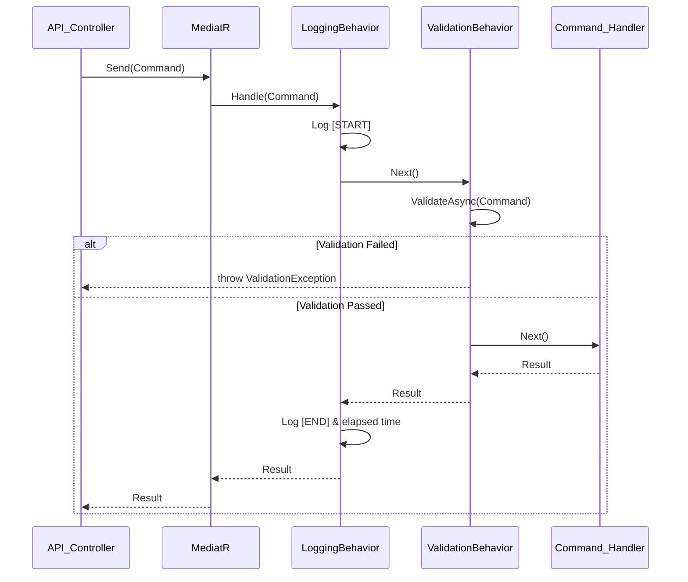

# Building Blocks

## Overview
The BuildingBlocks module contains shared, foundational components used across all microservices in the enterprise marketplace system. It promotes code reuse and consistency by providing base domain abstractions (such as `AggregateRoot`, `Entity`, `ValueObject`), cross-cutting pipeline behaviors for MediatR (like validation and logging), and common middleware (like global exception handling).

## Architecture
This module is structured into two primary libraries:
- **BuildingBlocks.SharedContracts**: Contains core Domain-Driven Design (DDD) abstractions (`AggregateRoot`, `Entity`, `ValueObject`, `IDomainEvent`, `IRepository`, `IUnitOfWork`). This library has zero dependencies and is used directly by the Domain layers of microservices.
- **BuildingBlocks.Infrastructure**: Contains shared infrastructural concerns and cross-cutting components. This includes generic response models (`Result`, `PagedResult`), the `GlobalExceptionMiddleware` for mapping exceptions to RFC 7807 ProblemDetails, and MediatR behaviors (`ValidationBehavior`, `LoggingBehavior`) to enforce standard validation and observability.

## Data Flow (MediatR Pipeline)


## Quick Start

### Prerequisites
- .NET 10 SDK

### Build the Shared Contracts
Navigate to the root of the solution and build the shared contracts:
```bash
dotnet build src/BuildingBlocks/SharedContracts/BuildingBlocks.SharedContracts.csproj
```

### Build the Infrastructure
Build the shared infrastructure components:
```bash
dotnet build src/BuildingBlocks/Infrastructure/BuildingBlocks.Infrastructure.csproj
```

### Adding to a Microservice
To use these building blocks in a new microservice, add references to these projects. Ensure you register the MediatR behaviors and middleware in the microservice's DI container and HTTP pipeline.
```csharp
// Register Behaviors in Program.cs
services.AddMediatR(cfg => {
    cfg.RegisterServicesFromAssembly(typeof(Program).Assembly);
    cfg.AddOpenBehavior(typeof(LoggingBehavior<,>));
    cfg.AddOpenBehavior(typeof(ValidationBehavior<,>));
});

// Register Middleware in Program.cs pipeline
app.UseMiddleware<GlobalExceptionMiddleware>();
```