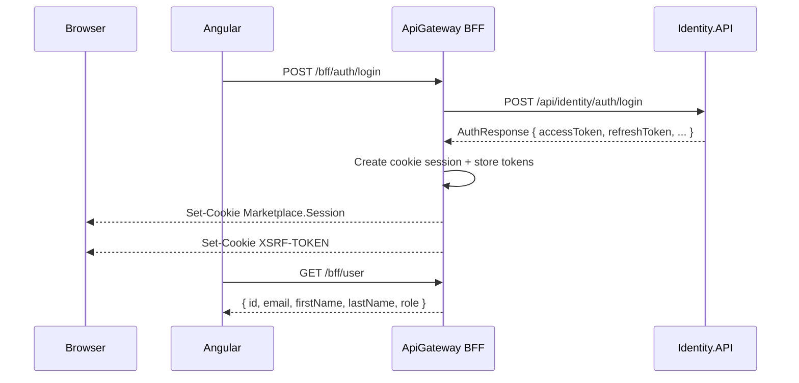
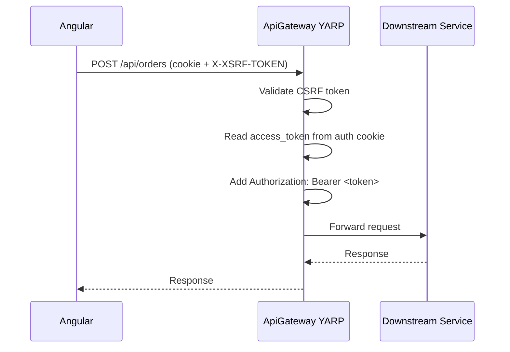

# API Gateway (YARP + BFF)

## Overview
The gateway is the only browser-facing backend in this solution. Angular must talk to it through `/bff/*`, `/api/*`, and `/hubs/*`. The browser never stores JWTs. The gateway stores them in the encrypted `Marketplace.Session` cookie and forwards them to downstream microservices as Bearer tokens.

## What Goes Where
- `/bff/auth/login` and `/bff/auth/register`: browser calls the gateway, gateway calls `Identity.API`, receives JWTs, signs in the cookie session, and returns `204 No Content`.
- `/bff/auth/logout`: browser clears the auth session through the gateway.
- `/bff/user`: browser asks the gateway for the current authenticated user profile derived from cookie claims.
- `/bff/csrf`: browser requests a fresh `XSRF-TOKEN` cookie. Angular then sends it back as `X-XSRF-TOKEN` on mutating requests.
- `/api/...`: browser calls a service route through the gateway. YARP routes the request to the correct microservice.
- `/hubs/...`: browser connects to SignalR through the gateway.

## Required Frontend Rules
- Always use relative URLs such as `/bff/auth/login` or `/api/catalog/products`.
- Always send cookies. The Angular interceptor already sets `withCredentials: true`.
- Never put access tokens or refresh tokens in `localStorage`, `sessionStorage`, or JS memory.
- Before authenticated mutating requests, ensure the `XSRF-TOKEN` cookie exists. Angular is configured to send the `X-XSRF-TOKEN` header automatically.
- In local development, the Angular dev server must proxy `/bff`, `/api`, and `/hubs` to the gateway. This repo now does that via [proxy.conf.mjs](</D:/code/Microservices/src/web/proxy.conf.mjs:1>).

## Auth Flow


## Business API Flow


## Route Map
- `/api/identity/*` -> `identity-api`
- `/api/catalog/*` -> `catalog-api`
- `/api/orders/*` -> `ordering-api`
- `/api/inventory/*` -> `inventory-api`
- `/api/cart/*` -> `cart-api`
- `/api/search/*` -> `search-api`
- `/api/stores/*` -> `store-api`
- `/api/media/*` -> `media-api`
- `/api/payments/*` -> `payment-api`
- `/hubs/*` -> `notification-worker`

The route definitions live in [appsettings.json](</D:/code/Microservices/src/Gateways/ApiGateway/appsettings.json:9>).

## Frontend Examples
```typescript
await http.post('/bff/auth/login', credentials);
const me = await http.get<User>('/bff/user');
const products = await http.get<Product[]>('/api/catalog/products');
await http.post('/api/orders', orderPayload);
await http.post('/bff/auth/logout', {});
```

## Local Development
1. Start the stack through Aspire: `dotnet run --project src/Aspire/Marketplace.AppHost/Marketplace.AppHost.csproj`
2. Open the Angular app on `http://localhost:4201`
3. Angular proxies `/bff`, `/api`, and `/hubs` to the gateway
4. The gateway proxies service calls internally through service discovery

## Debug Checklist
- `Cannot POST /api/...` usually means the Angular dev server proxy is missing or misconfigured.
- `401 Unauthorized` on `/bff/user` means there is no valid `Marketplace.Session` cookie.
- `403 CSRF validation failed` means the `XSRF-TOKEN` cookie or `X-XSRF-TOKEN` header is missing.
- A successful login should create both `Marketplace.Session` and `XSRF-TOKEN` cookies.
