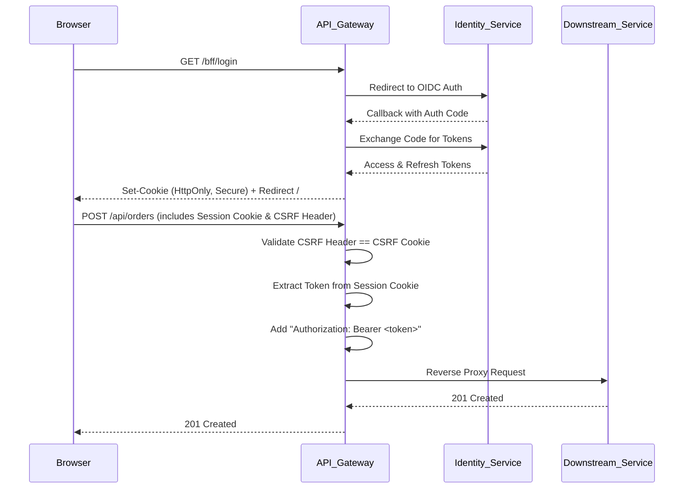

# API Gateway (YARP + BFF)

## Overview
The API Gateway is the single entry point for external clients (like the Angular SPA) to communicate with the microservices backend. It leverages **YARP (Yet Another Reverse Proxy)** to route HTTP traffic to the appropriate downstream microservice. Furthermore, it implements the **Backend-For-Frontend (BFF)** pattern, providing secure, cookie-based session management and CSRF protection, completely insulating the frontend from handling raw JWTs.

## Architecture
- **Reverse Proxy (YARP)**: Routes requests based on URL paths (e.g., `/api/catalog/**` goes to the Catalog service). Configuration is dynamically loaded or statically defined in `appsettings.json`.
- **BFF Authentication**: The gateway authenticates users via OpenID Connect (communicating with the Identity service). It stores the resulting JWTs securely in an encrypted, HttpOnly session cookie.
- **Cookie-to-Bearer Transformation**: A custom middleware intercepts requests bound for downstream services, extracts the access token from the secure cookie, and attaches it as a standard `Authorization: Bearer <token>` header.
- **CSRF Protection**: A custom middleware validates state-changing requests (POST, PUT, DELETE, PATCH) using the Double Submit Cookie pattern.

## Data Flow


## Quick Start

### Prerequisites
- .NET 10 SDK
- The Identity service and Aspire AppHost should be configured to run alongside the gateway.

### Build the Gateway
```bash
dotnet build src/Gateways/ApiGateway/ApiGateway.csproj
```

### Run the Gateway
It is highly recommended to run the gateway via the Aspire AppHost to ensure all dependent services are available and service discovery works.
```bash
dotnet run --project src/Aspire/Marketplace.AppHost/Marketplace.AppHost.csproj
```
