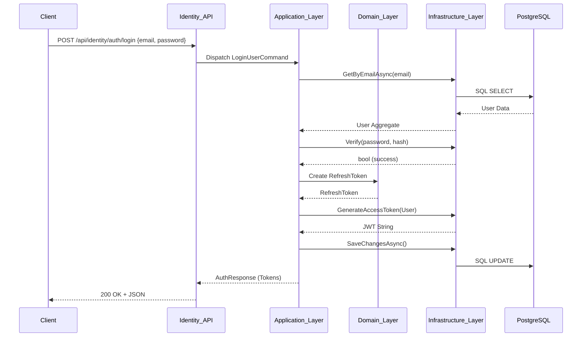

# Identity Microservice

## Overview
The Identity microservice is responsible for user authentication and authorization within the enterprise marketplace system. It manages user identities, roles, and securely stores credentials. It issues JSON Web Tokens (JWT) for secure, stateless authentication and supports token refreshing. The service exposes a minimal API and integrates with PostgreSQL for persistence.

## Architecture
The service strictly follows Clean Architecture principles:
- **Identity.Domain**: Contains the core business logic, entities (`User`, `Role`), and value objects (`Email`, `PasswordHash`, `RefreshToken`). It has zero dependencies on external frameworks or infrastructure.
- **Identity.Application**: Contains the CQRS commands (Register, Login) and queries handled via MediatR. It also enforces business validation rules using FluentValidation.
- **Identity.Infrastructure**: Implements data access using Entity Framework Core with PostgreSQL. It also houses implementations for password hashing and JWT token generation.
- **Identity.API**: Exposes HTTP endpoints using Minimal APIs. It configures the dependency injection container and wires up middlewares.

## Data Flow


## Quick Start

### Prerequisites
- .NET 10 SDK
- Docker (for Testcontainers or Aspire)
- An active PostgreSQL instance (handled automatically via Aspire AppHost)

### Build the Service
Navigate to the root of the solution and build the service:
```bash
dotnet build src/Microservices/Identity/Identity.API/Identity.API.csproj
```

### Apply Migrations
If not running via AppHost, you can apply migrations manually using the `dotnet-ef` tool:
```bash
dotnet ef database update --project src/Microservices/Identity/Identity.Infrastructure --startup-project src/Microservices/Identity/Identity.API
```

### Run the Service
Run the service independently (Note: running via AppHost is recommended for full environment setup):
```bash
dotnet run --project src/Microservices/Identity/Identity.API/Identity.API.csproj
```
