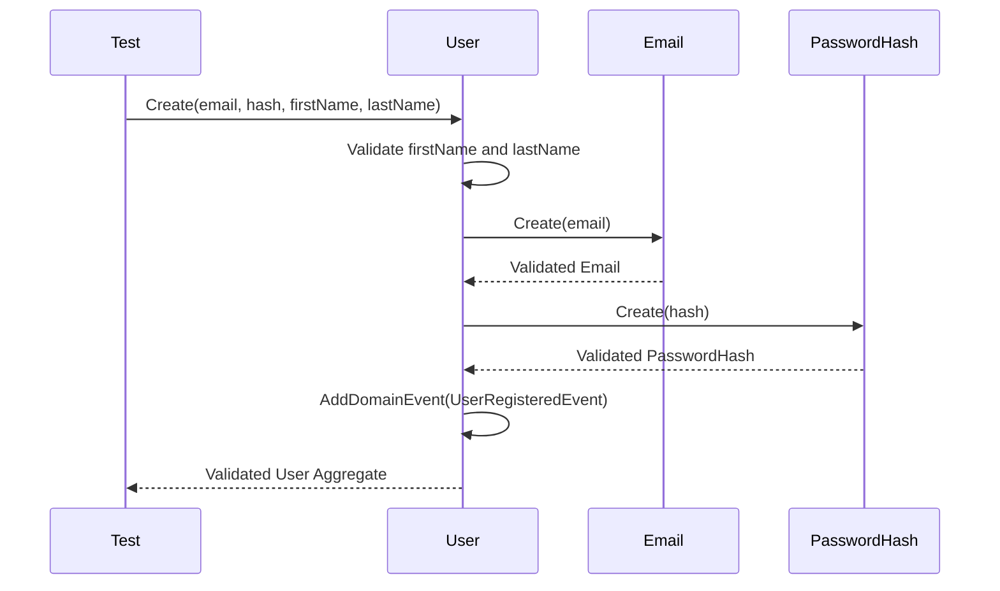

# Identity Domain Unit Tests

## Overview
This module contains unit tests for the Identity domain logic. Specifically, it tests the `User` aggregate root, ensuring that domain invariants, validation rules, and event generation operate as expected without relying on external infrastructure.

## Architecture
These tests validate the behavior of domain entities and value objects defined in the `Identity.Domain` layer. The primary flow involves instantiating domain objects via factory methods (e.g., `User.Create`) and verifying the state and generated domain events using xUnit and FluentAssertions.

## Main Logic Flow (Mermaid Diagram)


## Quick Start
To run the domain unit tests in this module, execute the following command from the repository root:

```bash
dotnet test tests/UnitTests/Identity.UnitTests/Identity.UnitTests.csproj --filter "FullyQualifiedName~Identity.UnitTests.Domain"
```
