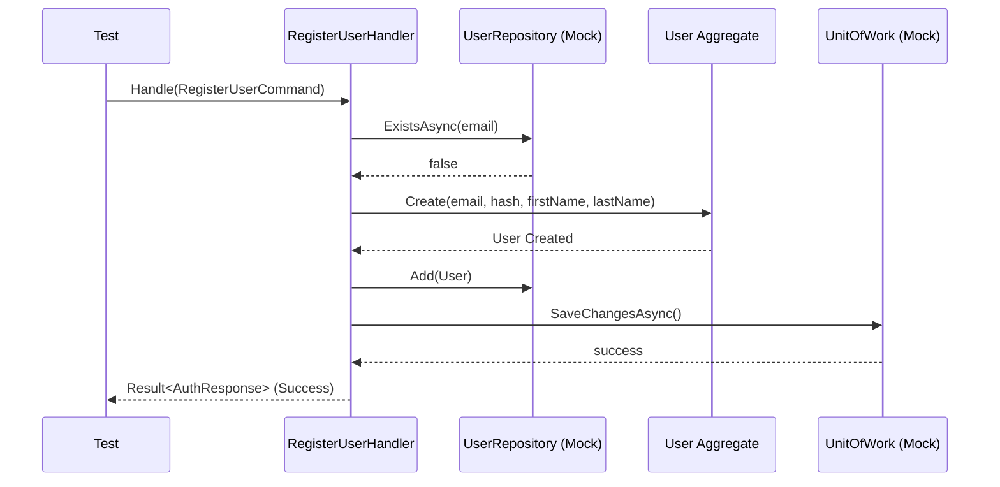

# Identity Service — Unit Tests

## Overview
This module contains comprehensive unit tests for the Identity service, covering both the `Identity.Domain` and `Identity.Application` layers. The purpose of these tests is to ensure that core business logic, domain invariants, aggregate root behaviors, and application command/query handlers function correctly in isolation without relying on external databases or infrastructure.

## Architecture
The tests are divided into structural components that mirror the source code structure:
- **Domain Layer Tests**: Verify the `User` aggregate root, value objects (`Email`, `PasswordHash`), and domain event generation.
- **Application Layer Tests**: Verify the business logic encapsulated in Command Handlers (`RegisterUserHandler`, `LoginUserHandler`) and Query Handlers (`GetUserByIdHandler`), utilizing mocking (via `Moq`) for repository and infrastructure dependencies like password hashing and JWT generation.

## Main Logic Flow (Application Registration Example)


## Quick Start
To install dependencies and execute the unit tests for this specific module, navigate to the root directory and run the following command:

```bash
dotnet test tests/UnitTests/Identity.UnitTests/Identity.UnitTests.csproj
```
